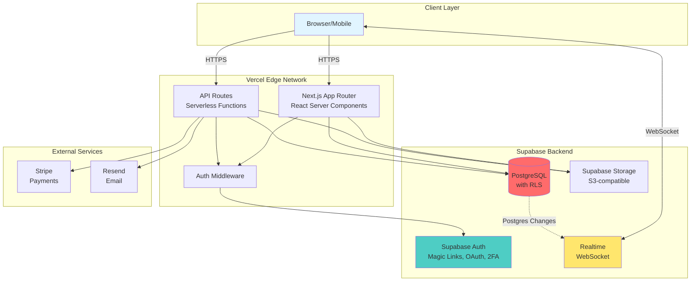
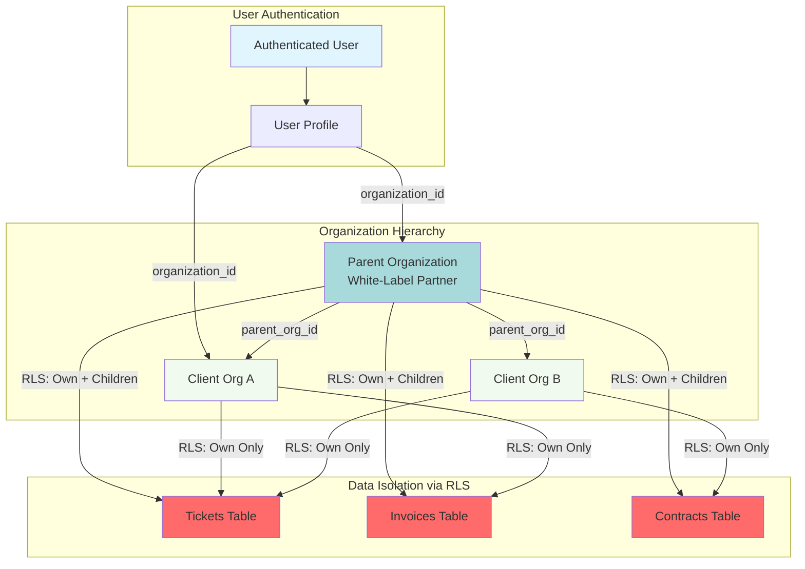
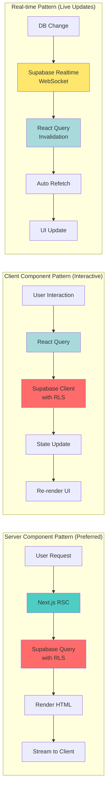

# KT-Portal CLAUDE.md

Project-level instructions for AI assistants working on this codebase.

## Quick Navigation

**Core Documentation:**

- [Project Overview](#project-overview) - Multi-tenant SaaS architecture
- [Critical Rules](#critical-rules) - Multi-tenancy, security, code style
- [Setup & Installation](#setup--installation) - Getting started guide
- [Architecture](#architecture) - System design and patterns

**Development:**

- [Key Patterns](#key-patterns) - Code examples and best practices
- [Development Workflow](#development-workflow) - Day-to-day development
- [Testing](#testing) - Testing strategy and coverage
- [Common Pitfalls](#common-pitfalls) - Avoid these mistakes

**Reference:**

- [Database Schema](#database-schema-overview) - Tables, relationships, RLS
- [API Endpoints](#api-endpoint-reference) - All routes and webhooks
- [Component Library](#component-library-reference) - UI components by domain
- [State Management](#state-management-overview) - React Query, Zustand, URL state
- [File Structure](#file-structure) - Project organization
- [CLI Commands](#cli-commands) - Available commands
- [Environment Variables](#environment-variables) - Configuration
- [Git Workflow](#git-workflow) - Branching and commits

**Operations:**

- [Performance Budgets](#performance-budgets) - Load time, bundle size targets
- [Monitoring](#monitoring--alerting-setup) - Error tracking, logging
- [Deployment Process](#deployment-architecture--process) - Deploy and rollback
- [Code Review](#code-review-process) - Checklists and guidelines
- [Team Communication](#team-communication-guidelines) - When and how to ask for help

## Project Overview

**KT-Portal** is a multi-tenant SaaS client portal for Kre8ivTech, LLC. It serves white-label partners and direct clients with ticketing, invoicing, contracts, knowledge base, live chat, and messaging capabilities.

**Tech Stack:**

- **Framework:** Next.js 14+ (App Router, TypeScript)
- **Hosting:** Vercel (Edge Network, Serverless Functions, Cron)
- **Database:** Supabase (PostgreSQL with RLS)
- **Auth:** Supabase Auth (Magic links, OAuth, 2FA)
- **Storage:** Supabase Storage
- **Real-Time:** Supabase Realtime (Postgres Changes, Presence, Broadcast)
- **Payments:** Stripe
- **Email:** Resend

**Design Approach:** Mobile-first responsive

## Setup & Installation

### Prerequisites

- Node.js 18+ and npm
- Supabase CLI (`npm install -g supabase`)
- Git

### Initial Setup

1. **Clone and Install**

   ```bash
   git clone <repository-url>
   cd kt-portal
   npm install
   ```

2. **Environment Configuration**

   ```bash
   cp .env.example .env.local
   # Edit .env.local with your Supabase credentials
   ```

3. **Supabase Local Development**

   ```bash
   supabase start
   supabase gen types typescript --local > src/types/database.ts
   ```

4. **Run Development Server**

   ```bash
   npm run dev
   ```

5. **Verify Setup**
   - Open your dev server URL (e.g. from `npm run dev`, or set `NEXT_PUBLIC_APP_URL`)
   - Check Supabase Studio (local: see `supabase status` for URLs)
   - Run tests: `npm test`

### First-Time Development Setup

1. **Create your feature branch**

   ```bash
   git checkout -b feature/KT-XXX-your-feature-name
   ```

2. **Understand the codebase**
   - Review `docs/prd.md` for product requirements
   - Review `docs/tech.md` for architecture decisions
   - Check `src/app/(dashboard)` for main application structure

3. **Set up your IDE**
   - Install recommended VS Code extensions (TypeScript, ESLint, Tailwind)
   - Enable TypeScript strict mode checking
   - Configure Prettier for consistent formatting

## Critical Rules

### 1. Multi-Tenancy First

Supabase RLS handles most isolation, but always be explicit about tenant context.

```typescript
// WRONG - Relying only on RLS without understanding context
const { data } = await supabase.from("tickets").select("*");

// CORRECT - Explicit about what you're querying
const { data } = await supabase
  .from("tickets")
  .select("*, created_by:profiles!created_by(name)")
  .eq("status", "open")
  .order("created_at", { ascending: false });
```

Always verify RLS policies exist before assuming data is filtered.

### 2. Code Organization

- Many small files over few large files
- High cohesion, low coupling
- 200-400 lines typical, 800 max per file
- Organize by feature/domain, not by type
- Colocate tests with components
- One component per file

### 3. Code Style

**General:**

- No emojis in code, comments, or documentation
- No `console.log()` in production code (use proper logging)
- Proper error handling with try/catch
- TypeScript strict mode enabled
- Input validation with Zod

**TypeScript/React:**

- Functional components only
- Immutability always - never mutate objects or arrays
- Use React Query for all server state
- Use Zustand sparingly for client-only state
- Prefer Server Components where possible
- Use `'use client'` directive only when needed

**Supabase:**

- Always use typed client (`Database` generic)
- Handle errors explicitly, don't ignore them
- Use `.single()` when expecting one row
- Use realtime subscriptions for live data

### 4. Testing

- Write tests for new features
- 80% minimum coverage target
- Unit tests with Vitest
- E2E tests with Playwright for critical flows
- Test RLS policies with different user contexts

### 5. Security

- Never expose `SUPABASE_SERVICE_ROLE_KEY` to client
- Use `createServerSupabaseClient()` in Server Components and API routes
- Use `createClient()` (browser client) only in Client Components
- Validate ALL user inputs with Zod schemas
- Sanitize file uploads (type, size)
- RLS policies are mandatory on all tables

### 6. API Design

- Use Next.js API Routes for complex logic
- Use Supabase direct queries for simple CRUD
- Consistent response format
- Proper HTTP status codes
- Rate limiting via Vercel

### 7. Database

- All tables must have RLS enabled
- Use UUID for primary keys
- Use TIMESTAMPTZ for timestamps
- JSONB for flexible structured data
- Create indexes for frequently queried columns
- Use Supabase migrations for schema changes

## Architecture

### System Overview

KT-Portal is a multi-tenant SaaS application built on the Vercel + Supabase stack:

- **Frontend**: Next.js 14+ with App Router (React Server Components)
- **Backend**: Next.js API Routes + Supabase Database Functions
- **Database**: Supabase PostgreSQL with Row-Level Security (RLS)
- **Real-time**: Supabase Realtime (WebSocket-based)
- **Auth**: Supabase Auth (Magic links, OAuth, 2FA)
- **Storage**: Supabase Storage (S3-compatible)
- **Hosting**: Vercel Edge Network
- **Payments**: Stripe
- **Email**: Resend

### Multi-Tenancy Architecture

**Tenant Isolation Strategy:**

1. **Database Level**: RLS policies enforce organization-level data isolation
2. **Application Level**: All queries explicitly filter by `organization_id`
3. **Auth Level**: User profiles linked to single organization
4. **White-Label Support**: Partners (parent orgs) can access client (child org) data via RLS

**Key Tables:**

- `organizations` - Tenant entities (supports parent-child for white-label)
- `profiles` - User accounts (linked to organization)
- `tickets`, `invoices`, `contracts` - All have `organization_id` FK

### Data Flow Patterns

**Server Component Pattern (Preferred):**

```
User Request → Next.js Server Component → Supabase (with RLS) → Render HTML → Client
```

**Client Component Pattern (Interactive UI):**

```
User Interaction → React Query → Supabase Client (with RLS) → State Update → Re-render
```

**Real-time Pattern:**

```
Database Change → Supabase Realtime → WebSocket → React Query Invalidation → Re-fetch
```

### Security Model

**Defense in Depth:**

1. **Row-Level Security (RLS)**: Primary tenant isolation at database
2. **Server-Side Auth Check**: Verify user session in API routes
3. **Input Validation**: Zod schemas for all user inputs
4. **CORS/CSP**: Vercel default security headers
5. **API Rate Limiting**: Vercel built-in rate limiting

**Service Role Usage:**

- Admin client (`supabaseAdmin`) ONLY used in server-side API routes
- Never exposed to client
- Used for cross-org operations (partner viewing client data)

### Visual Architecture Diagrams

#### System Architecture Overview



#### Multi-Tenancy Architecture



#### Data Flow Patterns



#### Deployment Architecture

```mermaid
graph TB
    subgraph "Development"
        Dev[Local Development<br/>localhost:3000]
        DevDB[(Supabase Local<br/>Docker)]
    end

    subgraph "Preview (Per PR)"
        Preview[Vercel Preview<br/>[pr-123].vercel.app]
        StageDB[(Supabase Staging<br/>Shared)]
    end

    subgraph "Production"
        Prod[Vercel Production<br/>app.ktportal.app]
        ProdDB[(Supabase Production<br/>High Availability)]
    end

    Dev --> DevDB
    Preview --> StageDB
    Prod --> ProdDB

    Dev -->|git push| Preview
    Preview -->|merge to main| Prod

    DevDB -->|supabase db push| StageDB
    StageDB -->|verified migration| ProdDB

    style Dev fill:#f1faee
    style Preview fill:#ffe66d
    style Prod fill:#4ecdc4
    style DevDB fill:#ff6b6b
    style StageDB fill:#ff6b6b
    style ProdDB fill:#ff6b6b
```

## File Structure

```
kt-portal/
├── CLAUDE.md
├── docs/
│   ├── prd.md
│   ├── tech.md
│   ├── changelog.md
│   ├── todo.md
│   └── scratchpad.md
│
├── src/
│   ├── app/                      # Next.js App Router
│   │   ├── (auth)/               # Auth route group
│   │   │   ├── login/page.tsx
│   │   │   ├── signup/page.tsx
│   │   │   └── callback/route.ts
│   │   │
│   │   ├── (dashboard)/          # Protected route group
│   │   │   ├── layout.tsx
│   │   │   ├── page.tsx          # Dashboard home
│   │   │   ├── tickets/
│   │   │   │   ├── page.tsx
│   │   │   │   └── [id]/page.tsx
│   │   │   ├── invoices/
│   │   │   ├── contracts/
│   │   │   ├── messages/
│   │   │   ├── knowledge-base/
│   │   │   └── settings/
│   │   │
│   │   ├── api/                  # API Routes
│   │   │   ├── webhooks/
│   │   │   │   ├── stripe/route.ts
│   │   │   │   └── supabase/route.ts
│   │   │   ├── invoices/
│   │   │   │   └── [id]/pdf/route.ts
│   │   │   └── cron/
│   │   │       └── reminders/route.ts
│   │   │
│   │   ├── layout.tsx            # Root layout
│   │   ├── page.tsx              # Landing page
│   │   └── globals.css
│   │
│   ├── components/
│   │   ├── ui/                   # Shadcn/ui components
│   │   │   ├── button.tsx
│   │   │   ├── input.tsx
│   │   │   ├── card.tsx
│   │   │   └── ...
│   │   │
│   │   ├── layout/               # Layout components
│   │   │   ├── sidebar.tsx
│   │   │   ├── bottom-nav.tsx
│   │   │   ├── header.tsx
│   │   │   └── page-container.tsx
│   │   │
│   │   ├── tickets/              # Feature components
│   │   │   ├── ticket-list.tsx
│   │   │   ├── ticket-card.tsx
│   │   │   ├── ticket-detail.tsx
│   │   │   └── create-ticket-form.tsx
│   │   │
│   │   ├── invoices/
│   │   ├── chat/
│   │   └── ...
│   │
│   ├── hooks/                    # Custom React hooks
│   │   ├── use-auth.ts
│   │   ├── use-organization.ts
│   │   ├── use-realtime-tickets.ts
│   │   └── ...
│   │
│   ├── lib/                      # Utilities
│   │   ├── supabase/
│   │   │   ├── client.ts         # Browser client
│   │   │   ├── server.ts         # Server client
│   │   │   ├── admin.ts          # Service role client
│   │   │   └── middleware.ts     # Auth middleware
│   │   ├── utils.ts
│   │   ├── cn.ts                 # className helper
│   │   └── validators/           # Zod schemas
│   │       ├── ticket.ts
│   │       ├── invoice.ts
│   │       └── ...
│   │
│   ├── types/
│   │   ├── database.ts           # Auto-generated from Supabase
│   │   └── index.ts              # Custom types
│   │
│   └── stores/                   # Zustand stores (minimal)
│       └── ui-store.ts
│
├── supabase/
│   ├── config.toml
│   ├── migrations/               # Database migrations
│   │   ├── 20260120000000_initial.sql
│   │   └── ...
│   └── functions/                # Edge Functions
│       └── calculate-queue/
│           └── index.ts
│
├── public/
│   ├── manifest.json
│   └── icons/
│
├── tests/
│   ├── e2e/
│   └── unit/
│
├── middleware.ts                 # Next.js middleware
├── next.config.js
├── tailwind.config.js
├── tsconfig.json
├── vercel.json
└── package.json
```

## Key Patterns

### Supabase Client Setup

```typescript
// lib/supabase/client.ts (Browser - Client Components)
import { createBrowserClient } from "@supabase/ssr";
import { Database } from "@/types/database";

export function createClient() {
  return createBrowserClient<Database>(
    process.env.NEXT_PUBLIC_SUPABASE_URL!,
    process.env.NEXT_PUBLIC_SUPABASE_ANON_KEY!,
  );
}

// lib/supabase/server.ts (Server Components & API Routes)
import { createServerClient } from "@supabase/ssr";
import { cookies } from "next/headers";
import { Database } from "@/types/database";

export async function createServerSupabaseClient() {
  const cookieStore = await cookies();

  return createServerClient<Database>(
    process.env.NEXT_PUBLIC_SUPABASE_URL!,
    process.env.NEXT_PUBLIC_SUPABASE_ANON_KEY!,
    {
      cookies: {
        getAll() {
          return cookieStore.getAll();
        },
        setAll(cookiesToSet) {
          cookiesToSet.forEach(({ name, value, options }) => {
            cookieStore.set(name, value, options);
          });
        },
      },
    },
  );
}

// lib/supabase/admin.ts (Service Role - Server Only, bypasses RLS)
import { createClient } from "@supabase/supabase-js";
import { Database } from "@/types/database";

export const supabaseAdmin = createClient<Database>(
  process.env.NEXT_PUBLIC_SUPABASE_URL!,
  process.env.SUPABASE_SERVICE_ROLE_KEY!,
);
```

### Server Component Data Fetching

```typescript
// app/(dashboard)/tickets/page.tsx
import { createServerSupabaseClient } from '@/lib/supabase/server'
import { TicketList } from '@/components/tickets/ticket-list'

export default async function TicketsPage() {
  const supabase = await createServerSupabaseClient()

  const { data: tickets, error } = await supabase
    .from('tickets')
    .select('*, created_by:profiles!created_by(name, avatar_url)')
    .order('created_at', { ascending: false })

  if (error) {
    throw new Error(error.message)
  }

  return <TicketList tickets={tickets} />
}
```

### Client Component with React Query

```typescript
// components/tickets/ticket-list.tsx
'use client'

import { useQuery } from '@tanstack/react-query'
import { createClient } from '@/lib/supabase/client'
import { TicketCard } from './ticket-card'

export function TicketList({ initialTickets }) {
  const supabase = createClient()

  const { data: tickets } = useQuery({
    queryKey: ['tickets'],
    queryFn: async () => {
      const { data, error } = await supabase
        .from('tickets')
        .select('*')
        .order('created_at', { ascending: false })

      if (error) throw error
      return data
    },
    initialData: initialTickets,
  })

  return (
    <div className="space-y-4">
      {tickets?.map((ticket) => (
        <TicketCard key={ticket.id} ticket={ticket} />
      ))}
    </div>
  )
}
```

### Realtime Subscriptions

```typescript
// hooks/use-realtime-tickets.ts
"use client";

import { useEffect } from "react";
import { useQueryClient } from "@tanstack/react-query";
import { createClient } from "@/lib/supabase/client";

export function useRealtimeTickets() {
  const queryClient = useQueryClient();
  const supabase = createClient();

  useEffect(() => {
    const channel = supabase
      .channel("tickets-changes")
      .on(
        "postgres_changes",
        { event: "*", schema: "public", table: "tickets" },
        (payload) => {
          // Invalidate to refetch
          queryClient.invalidateQueries({ queryKey: ["tickets"] });
        },
      )
      .subscribe();

    return () => {
      supabase.removeChannel(channel);
    };
  }, [queryClient, supabase]);
}
```

### API Route Pattern

```typescript
// app/api/tickets/route.ts
import { NextRequest, NextResponse } from "next/server";
import { createServerSupabaseClient } from "@/lib/supabase/server";
import { createTicketSchema } from "@/lib/validators/ticket";

export async function POST(request: NextRequest) {
  try {
    const supabase = await createServerSupabaseClient();

    // Check auth
    const {
      data: { user },
      error: authError,
    } = await supabase.auth.getUser();
    if (authError || !user) {
      return NextResponse.json({ error: "Unauthorized" }, { status: 401 });
    }

    // Validate input
    const body = await request.json();
    const result = createTicketSchema.safeParse(body);
    if (!result.success) {
      return NextResponse.json(
        { error: "Validation failed", details: result.error.flatten() },
        { status: 400 },
      );
    }

    // Get user's org
    const { data: profile } = await supabase
      .from("profiles")
      .select("organization_id")
      .eq("id", user.id)
      .single();

    // Insert
    const { data: ticket, error } = await supabase
      .from("tickets")
      .insert({
        ...result.data,
        organization_id: profile?.organization_id,
        created_by: user.id,
      })
      .select()
      .single();

    if (error) {
      return NextResponse.json({ error: error.message }, { status: 500 });
    }

    return NextResponse.json({ data: ticket }, { status: 201 });
  } catch (err) {
    return NextResponse.json(
      { error: "Internal server error" },
      { status: 500 },
    );
  }
}
```

### Zod Validation Schema

```typescript
// lib/validators/ticket.ts
import { z } from "zod";

export const createTicketSchema = z.object({
  subject: z.string().min(5).max(500),
  description: z.string().min(10).max(10000),
  priority: z.enum(["low", "medium", "high", "critical"]).default("medium"),
  category: z.string().optional(),
});

export type CreateTicketInput = z.infer<typeof createTicketSchema>;
```

### Mobile-First Component

```typescript
// components/tickets/ticket-card.tsx
import { Card } from '@/components/ui/card'
import { Badge } from '@/components/ui/badge'
import { cn } from '@/lib/cn'
import type { Database } from '@/types/database'

type Ticket = Database['public']['Tables']['tickets']['Row']

interface TicketCardProps {
  ticket: Ticket
  onClick?: () => void
}

export function TicketCard({ ticket, onClick }: TicketCardProps) {
  return (
    <Card
      onClick={onClick}
      className={cn(
        // Mobile first - base styles
        "p-4 cursor-pointer active:bg-muted",
        // Tablet and up
        "md:p-6 md:hover:shadow-md md:transition-shadow"
      )}
    >
      <div className="flex items-start justify-between gap-2">
        <div className="flex-1 min-w-0">
          <h3 className="font-medium truncate">{ticket.subject}</h3>
          <p className="text-sm text-muted-foreground mt-1">
            {ticket.ticket_number}
          </p>
        </div>
        <Badge variant={getPriorityVariant(ticket.priority)}>
          {ticket.priority}
        </Badge>
      </div>

      {ticket.queue_position && (
        <p className="text-xs text-muted-foreground mt-2">
          Queue position: #{ticket.queue_position}
        </p>
      )}
    </Card>
  )
}
```

### Next.js Middleware for Auth

```typescript
// middleware.ts
import { createServerClient } from "@supabase/ssr";
import { NextResponse, type NextRequest } from "next/server";

export async function middleware(request: NextRequest) {
  let supabaseResponse = NextResponse.next({ request });

  const supabase = createServerClient(
    process.env.NEXT_PUBLIC_SUPABASE_URL!,
    process.env.NEXT_PUBLIC_SUPABASE_ANON_KEY!,
    {
      cookies: {
        getAll() {
          return request.cookies.getAll();
        },
        setAll(cookiesToSet) {
          cookiesToSet.forEach(({ name, value, options }) => {
            request.cookies.set(name, value);
          });
          supabaseResponse = NextResponse.next({ request });
          cookiesToSet.forEach(({ name, value, options }) => {
            supabaseResponse.cookies.set(name, value, options);
          });
        },
      },
    },
  );

  const {
    data: { user },
  } = await supabase.auth.getUser();

  // Redirect to login if not authenticated and accessing protected route
  if (!user && request.nextUrl.pathname.startsWith("/dashboard")) {
    const url = request.nextUrl.clone();
    url.pathname = "/login";
    return NextResponse.redirect(url);
  }

  return supabaseResponse;
}

export const config = {
  matcher: [
    "/((?!_next/static|_next/image|favicon.ico|.*\\.(?:svg|png|jpg|jpeg|gif|webp)$).*)",
  ],
};
```

### RLS Policy Pattern

```sql
-- supabase/migrations/20260120000001_tickets_rls.sql

-- Enable RLS
ALTER TABLE tickets ENABLE ROW LEVEL SECURITY;

-- Users can view tickets in their organization
CREATE POLICY "Users can view org tickets"
  ON tickets FOR SELECT
  USING (
    organization_id IN (
      SELECT organization_id FROM profiles
      WHERE id = auth.uid()
    )
  );

-- Users can create tickets in their organization
CREATE POLICY "Users can create org tickets"
  ON tickets FOR INSERT
  WITH CHECK (
    organization_id IN (
      SELECT organization_id FROM profiles
      WHERE id = auth.uid()
    )
  );

-- Partners can view their clients' tickets
CREATE POLICY "Partners can view client tickets"
  ON tickets FOR SELECT
  USING (
    organization_id IN (
      SELECT id FROM organizations
      WHERE parent_org_id IN (
        SELECT organization_id FROM profiles
        WHERE id = auth.uid()
      )
    )
  );
```

## Reference

### Database Schema Overview

**Multi-Tenancy Tables:**

| Table | Purpose | Key Columns | RLS Notes |
|-------|---------|-------------|-----------|
| `organizations` | Tenant entities | `id`, `name`, `parent_org_id`, `domain` | Partners can view children |
| `profiles` | User accounts | `id`, `email`, `organization_id`, `role` | 1:1 with auth.users |

**Feature Tables:**

| Table | Purpose | Key Columns | RLS Notes |
|-------|---------|-------------|-----------|
| `tickets` | Support tickets | `id`, `ticket_number`, `organization_id`, `created_by`, `status`, `priority`, `queue_position` | Org-scoped, partners see children |
| `invoices` | Invoicing | `id`, `invoice_number`, `organization_id`, `total`, `status`, `stripe_invoice_id` | Org-scoped, Stripe integration |
| `contracts` | Service agreements | `id`, `organization_id`, `title`, `status`, `signed_at` | Org-scoped, e-signature flow |
| `messages` | Internal messaging | `id`, `organization_id`, `from_user`, `to_user`, `content` | User-scoped within org |
| `knowledge_base_articles` | Self-service docs | `id`, `organization_id`, `title`, `content`, `category`, `is_public` | Org-scoped, public articles |

**Relationship Patterns:**
- All feature tables have `organization_id` FK → `organizations.id`
- All feature tables have `created_by` FK → `profiles.id`
- Parent/child org relationship via `organizations.parent_org_id` → `organizations.id`
- White-label partners (parent orgs) can access client (child org) data via RLS

**Common Patterns:**
- All PKs are UUID (`gen_random_uuid()`)
- All timestamps are TIMESTAMPTZ (`created_at`, `updated_at`)
- Flexible metadata stored in JSONB columns
- Soft deletes use `deleted_at` TIMESTAMPTZ (nullable)

See full schema details in `/docs/tech.md` Section 3.
See migrations in `/supabase/migrations/`.

### API Endpoint Reference

**Tickets API**
- `POST /api/tickets` - Create ticket (auth required, org auto-assigned)
- `GET /api/tickets/[id]` - Get ticket details (RLS enforced)
- `PATCH /api/tickets/[id]` - Update ticket (RLS enforced)
- `DELETE /api/tickets/[id]` - Delete ticket (admin only)

**Invoices API**
- `POST /api/invoices` - Create invoice (admin only)
- `GET /api/invoices/[id]` - Get invoice details (RLS enforced)
- `GET /api/invoices/[id]/pdf` - Generate invoice PDF (RLS enforced)
- `POST /api/invoices/[id]/pay` - Process payment via Stripe (RLS enforced)

**Contracts API**
- `POST /api/contracts` - Create contract (admin only)
- `GET /api/contracts/[id]` - Get contract details (RLS enforced)
- `POST /api/contracts/[id]/sign` - E-signature flow (RLS enforced)

**Messages API**
- `POST /api/messages` - Send message (auth required)
- `GET /api/messages` - List conversations (user-scoped)
- `GET /api/messages/[conversationId]` - Get conversation thread (RLS enforced)

**Webhooks**
- `POST /api/webhooks/stripe` - Stripe payment events (webhook signature verified)
- `POST /api/webhooks/supabase` - Database change notifications (internal only)

**Cron Jobs (Vercel)**
- `GET /api/cron/reminders` - Daily ticket reminders (9am UTC, Vercel auth)
- `GET /api/cron/queue-calculate` - Recalculate queue positions (daily, Vercel auth)

**Auth Endpoints (Next.js)**
- `GET /api/auth/callback` - OAuth callback handler
- `POST /api/auth/signout` - Sign out user

See implementation in `/src/app/api/` directory.

### Component Library Reference

**Layout Components (`src/components/layout/`)**
- `Sidebar` - Desktop navigation (shows on md+ breakpoints)
  - Props: `currentPath`, `organizationName`, `userRole`
  - Features: Collapsible, role-based menu items, org switcher
- `BottomNav` - Mobile navigation (shows on <md breakpoints)
  - Props: `currentPath`
  - Features: Fixed bottom bar, active state, 5 main routes
- `Header` - Top bar with org switcher and user menu
  - Props: `user`, `organization`
  - Features: Org switcher (for partners), notifications, user dropdown
- `PageContainer` - Standard page wrapper with responsive padding
  - Props: `title?`, `actions?`, `children`
  - Features: Breadcrumbs, page title, action buttons, consistent spacing

**UI Primitives (`src/components/ui/`)**

Built on shadcn/ui (Radix + Tailwind):

Form controls:
- `Button` - Primary, secondary, outline, ghost, destructive variants
- `Input` - Text, email, password, with validation states
- `Select` - Dropdown select with search
- `Textarea` - Multi-line text input
- `Checkbox` - Boolean input with label
- `RadioGroup` - Mutually exclusive options
- `Switch` - Toggle boolean

Layout:
- `Card` - Container with header, content, footer
- `Separator` - Horizontal or vertical divider
- `Tabs` - Tabbed interface
- `Sheet` - Slide-in panel (mobile drawer)
- `Dialog` - Modal dialog
- `Popover` - Floating content

Feedback:
- `Badge` - Status indicator (default, success, warning, destructive)
- `Alert` - Notice banner (info, success, warning, error)
- `Toast` - Temporary notification
- `Spinner` - Loading indicator
- `Progress` - Progress bar
- `Skeleton` - Loading placeholder

See [shadcn/ui docs](https://ui.shadcn.com/docs/components) for props and usage.

**Feature Components (by domain)**

Tickets (`src/components/tickets/`):
- `TicketList` - Paginated ticket list with filters
- `TicketCard` - Individual ticket in list (mobile-first)
- `TicketDetail` - Full ticket view with comments
- `CreateTicketForm` - New ticket form with validation
- `TicketStatusBadge` - Visual status indicator
- `TicketComments` - Comment thread with realtime updates

Invoices (`src/components/invoices/`):
- `InvoiceList` - Invoice list with status filters
- `InvoiceCard` - Invoice summary card
- `InvoiceDetail` - Full invoice view
- `InvoicePDFViewer` - Embedded PDF viewer
- `PaymentForm` - Stripe payment form (PCI compliant)

Chat (`src/components/chat/`):
- `ChatInterface` - Full chat UI with message list
- `MessageBubble` - Individual message (sent/received)
- `TypingIndicator` - Shows when user is typing
- `ChatInput` - Message compose area with file upload

Contracts (`src/components/contracts/`):
- `ContractList` - Contract list with status filters
- `ContractViewer` - Document viewer
- `SignatureFlow` - E-signature interface
- `ContractStatusBadge` - Visual status indicator

**Component Patterns:**
- Server Components by default (no 'use client')
- Client Components only for interactivity (forms, real-time, animations)
- Mobile-first responsive (base styles = mobile, md+ = desktop)
- TypeScript with strict types from Database schema
- Props validated with TypeScript, not runtime checks
- Immutable state updates only

### State Management Overview

**React Query (Server State)**

Use React Query for ALL server data:
- Fetching from Supabase
- API route responses
- Real-time data synchronization

```typescript
// Always use React Query for server data
const { data, isLoading, error } = useQuery({
  queryKey: ['tickets', filters],
  queryFn: () => fetchTickets(filters),
  staleTime: 5 * 60 * 1000, // 5 minutes
})
```

**When NOT to use React Query:**
- Local UI state (use useState)
- Form state (use useState or React Hook Form)
- Global client-only state (use Zustand sparingly)

**Zustand (Client-Only State)**

Use Zustand SPARINGLY for:
- UI preferences (sidebar collapsed, theme)
- Global UI state (modal open state)
- Client-only app state (no server data)

```typescript
// Only for client-only global state
const useUIStore = create((set) => ({
  sidebarOpen: true,
  toggleSidebar: () => set((state) => ({ sidebarOpen: !state.sidebarOpen })),
}))
```

**When NOT to use Zustand:**
- Any data from server (use React Query)
- Component-local state (use useState)
- Form state (use useState or React Hook Form)

**URL State**

Use URL params for:
- Current page/tab
- Filters and search
- Sort order
- Selected item ID

```typescript
// Use Next.js searchParams for shareable state
const searchParams = useSearchParams()
const status = searchParams.get('status') || 'open'
```

**Component Local State**

Use useState for:
- Form inputs
- UI toggles (dropdowns, tooltips)
- Temporary UI state
- Component-specific state

```typescript
// Local state for simple UI
const [isOpen, setIsOpen] = useState(false)
```

**State Management Decision Tree:**

1. Is this data from the server? → **React Query**
2. Does this need to be shared across routes? → **URL params**
3. Does this need to be shared across many components? → **Zustand** (if client-only)
4. Is this component-local? → **useState**

## Environment Variables

```bash
# .env.local

# Supabase (required)
NEXT_PUBLIC_SUPABASE_URL=https://xxxxx.supabase.co
NEXT_PUBLIC_SUPABASE_ANON_KEY=eyJ...
SUPABASE_SERVICE_ROLE_KEY=eyJ...  # Never expose to client!

# Stripe (required)
STRIPE_SECRET_KEY=sk_live_...
STRIPE_WEBHOOK_SECRET=whsec_...
NEXT_PUBLIC_STRIPE_PUBLISHABLE_KEY=pk_live_...

# Email (required)
RESEND_API_KEY=re_...

# App
NEXT_PUBLIC_APP_URL=https://app.ktportal.app
```

## Available Commands

Use these slash commands when working with Claude on this project:

- `/plan` - Create implementation plan for a feature
- `/component` - Create a React component following project patterns
- `/api-route` - Create a Next.js API route
- `/migration` - Create a Supabase migration
- `/rls-policy` - Create RLS policies for a table
- `/hook` - Create a custom React hook
- `/validate` - Create a Zod validation schema
- `/test` - Create tests for a component or function

## Git Workflow

### Branch Naming

```
feature/KT-123-ticket-queue
fix/KT-456-invoice-pdf
refactor/extract-auth-hook
```

### Commit Messages (Conventional)

```
feat(tickets): add queue position display
fix(invoices): correct tax calculation
refactor(auth): extract to custom hook
```

### PR Rules

- Never commit directly to `main`
- All tests must pass
- Type check must pass
- At least one review required

## Development Workflow

### Daily Development Flow

1. **Pull latest changes**

   ```bash
   git checkout main
   git pull origin main
   ```

2. **Create feature branch**

   ```bash
   git checkout -b feature/KT-XXX-description
   ```

3. **Make changes following patterns**
   - Use existing components as reference
   - Follow file organization conventions
   - Add tests for new features

4. **Run quality checks**

   ```bash
   npm run lint          # ESLint
   npm run type-check    # TypeScript
   npm test              # Vitest
   ```

5. **Commit with conventional commits**

   ```bash
   git add .
   git commit -m "feat(tickets): add queue position indicator"
   ```

6. **Push and create PR**
   ```bash
   git push origin feature/KT-XXX-description
   # Create PR via GitHub UI or gh CLI
   ```

### When Adding New Features

**Step 1: Plan**

- Review `docs/prd.md` for requirements
- Check if similar features exist
- Identify which tables/RLS policies are affected

**Step 2: Database First**

- Create Supabase migration if schema changes needed
- Add/update RLS policies
- Generate new TypeScript types

**Step 3: Backend**

- Create/update API routes if needed
- Add Zod validation schemas
- Implement server actions or API endpoints

**Step 4: Frontend**

- Create React components (prefer Server Components)
- Add Client Components only for interactivity
- Use React Query for client-side data fetching
- Implement real-time subscriptions if needed

**Step 5: Test**

- Write unit tests for utilities/hooks
- Add E2E tests for critical flows
- Test RLS policies with different user roles

### When Fixing Bugs

1. **Reproduce** - Write a failing test first (TDD)
2. **Locate** - Use browser DevTools, Supabase logs, Vercel logs
3. **Fix** - Make minimal change to fix root cause
4. **Verify** - Ensure test passes, no regressions
5. **Document** - Update CHANGELOG.md if user-facing

### Code Review Process

#### Before Requesting Review

**Author Checklist:**
- [ ] All tests pass locally (`npm test`)
- [ ] TypeScript compiles without errors (`npm run type-check`)
- [ ] ESLint passes with no warnings (`npm run lint`)
- [ ] No `console.log()` statements in production code
- [ ] All async operations have proper error handling
- [ ] New database queries tested with RLS (different user roles)
- [ ] Components are mobile-first responsive
- [ ] User inputs validated with Zod schemas
- [ ] Database migrations tested locally (if applicable)
- [ ] Updated relevant documentation
- [ ] Self-reviewed the code (read your own PR)
- [ ] Removed commented-out code and debug logs

**PR Description Template:**

```markdown
## What
Brief description of the change (1-2 sentences)

## Why
Business context or issue being solved
Closes #[issue-number]

## How
Technical approach and key decisions
- Key decision 1
- Key decision 2

## Testing
How to verify the change works
1. Step 1
2. Step 2
3. Expected result

## Screenshots (if UI change)
Before/After or demo of new feature

## Database Changes (if applicable)
- [ ] New migration file added
- [ ] Migration tested locally
- [ ] Migration is non-breaking (additive)
- [ ] Rollback plan documented

## Checklist
- [ ] Tests added/updated
- [ ] RLS policies tested with multiple user roles
- [ ] Mobile responsive verified (tested on < md breakpoint)
- [ ] Accessibility checked (keyboard navigation, screen reader)
- [ ] Performance impact considered (bundle size, query count)
```

#### During Review

**Reviewer Checklist:**

**Code Quality:**
- [ ] Code follows existing patterns in the codebase
- [ ] Function names are descriptive and self-documenting
- [ ] Complex logic has explanatory comments
- [ ] No unnecessary complexity or over-engineering
- [ ] Code is DRY (Don't Repeat Yourself)

**Multi-Tenancy:**
- [ ] Multi-tenancy properly implemented (`organization_id` filtering)
- [ ] RLS policies updated if new tables/columns added
- [ ] Organization context explicit in queries

**Security:**
- [ ] No service role key (`SUPABASE_SERVICE_ROLE_KEY`) in client code
- [ ] No accidental exposure of sensitive data
- [ ] User inputs validated with Zod schemas
- [ ] SQL injection prevented (using Supabase query builder)
- [ ] XSS prevented (React escapes by default, but verify)

**Testing:**
- [ ] Tests cover new functionality adequately
- [ ] Tests are meaningful, not just for coverage
- [ ] Edge cases handled (empty states, errors, loading)
- [ ] Tests are readable and maintainable

**Performance:**
- [ ] No N+1 queries (check for loops with queries)
- [ ] Database indexes added for new query patterns
- [ ] Bundle size impact acceptable (< 50KB per route)
- [ ] Images optimized (use Next.js Image component)
- [ ] No unnecessary re-renders (React DevTools)

**Accessibility:**
- [ ] Component is keyboard navigable
- [ ] Screen reader friendly (semantic HTML, ARIA labels)
- [ ] Color contrast meets WCAG AA standards
- [ ] Focus indicators visible

**Mobile-First:**
- [ ] Base styles work on mobile (320px width)
- [ ] Responsive breakpoints used correctly
- [ ] Touch targets are at least 44x44px
- [ ] No horizontal scrolling on mobile

**Review Guidelines:**

**Blocking Issues (Request changes):**
- Security vulnerabilities
- Broken functionality
- Test failures
- RLS policy violations
- Production errors

**Non-Blocking Suggestions (Approve with comments):**
- Code style improvements
- Performance optimizations
- Refactoring opportunities
- Documentation enhancements

**Review Tone:**
- Be specific: "Consider extracting this into a function" not "This is messy"
- Be constructive: Suggest alternatives, not just problems
- Ask questions: "Why did you choose X over Y?" to understand decisions
- Praise good work: "Nice error handling here!"

**Definition of Done:**

**For Bug Fixes:**
- [ ] Bug reproduced with failing test
- [ ] Bug fixed with minimal changes
- [ ] Test now passes
- [ ] No regressions in related functionality
- [ ] Root cause documented in commit message

**For Features:**
- [ ] Feature works as specified in requirements
- [ ] All acceptance criteria met
- [ ] Tests cover happy path and edge cases
- [ ] Mobile responsive
- [ ] Accessible (keyboard, screen reader)
- [ ] RLS policies tested
- [ ] Documentation updated

**For Refactoring:**
- [ ] Functionality unchanged (tests still pass)
- [ ] Code is simpler or more maintainable
- [ ] Performance improved or unchanged
- [ ] No breaking changes to API

**For Database Changes:**
- [ ] Migration is additive (non-breaking)
- [ ] RLS policies updated for new tables/columns
- [ ] Indexes added for new query patterns
- [ ] Migration tested locally
- [ ] Types regenerated (`supabase gen types`)

### Team Communication Guidelines

**When to Ask for Help:**
- Blocked for more than 30 minutes on a technical issue
- Unsure about architecture decision that affects multiple components
- Need clarification on requirements or business logic
- Security concern or question about best practices
- Database schema design question
- Need help understanding existing code

**Who to Ask:**

| Question Type | Resource |
|---------------|----------|
| Multi-tenancy & RLS | Lead Backend Developer / This CLAUDE.md |
| UI/UX decisions | Design Lead / `/docs/design.md` |
| Database & performance | Database Admin / `/docs/tech.md` |
| DevOps & deployment | DevOps Lead / This CLAUDE.md Deployment section |
| Business logic | Product Manager / `/docs/prd.md` |
| Supabase specifics | Supabase docs / This CLAUDE.md patterns |
| Next.js specifics | Next.js docs / This CLAUDE.md patterns |

**Communication Channels:**
- **Urgent production issues:** [Emergency contact / on-call system]
- **Technical questions:** [Team chat / Slack / Discord]
- **Async updates:** [Daily standup / Status updates]
- **Documentation:** Update `/docs/scratchpad.md` for discoveries

**Before Asking:**
1. Check this CLAUDE.md for relevant patterns
2. Search codebase for similar implementations
   ```bash
   # Find similar components
   grep -r "useQuery" src/components/

   # Find similar hooks
   ls src/hooks/
   ```
3. Review relevant docs (`/docs/prd.md`, `/docs/tech.md`, `/docs/permissions-guide.md`)
4. Try to debug for 30 minutes with browser DevTools
5. Check if issue is documented in Troubleshooting section below

**When Asking:**
- **Share context**: What you've tried, what you've searched
- **Include error messages/logs**: Copy full error, not just summary
- **Describe expected vs actual**: "I expected X, but got Y"
- **Link to relevant code**: Share file path and line numbers
- **Describe impact**: "This blocks the invoice feature" vs "Nice to have"

**Example Good Question:**

> I'm trying to implement ticket filtering by status, but the query is returning all tickets regardless of status filter. I've checked:
> 1. The `status` parameter is being passed correctly (verified in console)
> 2. The RLS policy allows SELECT on tickets
> 3. Similar pattern works in `InvoiceList.tsx:45`
>
> Error: No error, but filter doesn't work
> File: `src/components/tickets/TicketList.tsx:78`
> Expected: Tickets filtered by status
> Actual: All tickets returned
>
> Code snippet:
> ```typescript
> const { data } = await supabase
>   .from('tickets')
>   .select('*')
>   .eq('status', status)
> ```

**Example Bad Question:**

> Tickets filter not working. Help?

## CLI Commands

```bash
# Development
npm run dev                        # Start Next.js dev server
npm run build                      # Build for production
npm run start                      # Start production server
npm run lint                       # Run ESLint
npm run type-check                 # Run TypeScript check

# Testing
npm test                           # Run Vitest
npm run test:e2e                   # Run Playwright E2E tests
npm run test:coverage              # Run tests with coverage

# Supabase CLI
supabase start                     # Start local Supabase
supabase stop                      # Stop local Supabase
supabase gen types typescript --local > src/types/database.ts  # Generate types
supabase migration new my_migration_name  # Create new migration
supabase db push                   # Push migrations to remote
supabase db pull                   # Pull remote schema changes
supabase functions deploy fn-name  # Deploy Edge Function
supabase logs                      # View local logs
```

## Common Pitfalls

### Avoid These

```typescript
// BAD: Using service role key in client component
'use client'
import { supabaseAdmin } from '@/lib/supabase/admin' // NEVER!

// BAD: Not handling Supabase errors
const { data } = await supabase.from('tickets').select('*')
// Always check error!

// BAD: Mutating state
const handleUpdate = () => {
  ticket.status = 'closed'  // Never mutate!
  setTicket(ticket)
}

// BAD: Using useEffect for data fetching
useEffect(() => {
  fetch('/api/tickets').then(...)  // Use React Query!
}, [])

// BAD: Missing 'use client' directive
import { useState } from 'react'  // This will fail without 'use client'
```

### Do This Instead

```typescript
// GOOD: Proper client in client component
"use client";
import { createClient } from "@/lib/supabase/client";

// GOOD: Always handle errors
const { data, error } = await supabase.from("tickets").select("*");
if (error) {
  console.error("Failed to fetch tickets:", error);
  throw error;
}

// GOOD: Immutable updates
const handleUpdate = () => {
  setTicket((prev) => ({ ...prev, status: "closed" }));
};

// GOOD: React Query for data fetching
const { data: tickets } = useQuery({
  queryKey: ["tickets"],
  queryFn: fetchTickets,
});

// GOOD: Explicit client directive
("use client");
import { useState } from "react";
```

## Vercel-Specific

### Cron Jobs (vercel.json)

```json
{
  "crons": [{ "path": "/api/cron/reminders", "schedule": "0 9 * * *" }]
}
```

### Edge vs Serverless

- Use Edge for fast, simple operations
- Use Serverless (Node.js) for complex logic, PDF generation

```typescript
// Edge runtime
export const runtime = "edge";

// Node.js runtime (default)
export const runtime = "nodejs";
```

### Environment Variables in Vercel

- Add all env vars in Vercel Dashboard > Settings > Environment Variables
- Use different values for Preview, Development, and Production

## Operational Excellence

### Performance Budgets

**Bundle Size Targets:**
- Initial page load: < 150KB gzipped JavaScript
- Route chunk: < 50KB gzipped per page
- Total CSS: < 30KB gzipped
- First-party scripts only (no heavy analytics libraries)

**Load Time Targets (3G network):**
- Time to First Byte (TTFB): < 600ms
- First Contentful Paint (FCP): < 1.8s
- Largest Contentful Paint (LCP): < 2.5s
- Time to Interactive (TTI): < 3.8s
- Cumulative Layout Shift (CLS): < 0.1
- First Input Delay (FID): < 100ms

**Database Query Targets:**
- Simple SELECT: < 50ms
- Complex joins (2-3 tables): < 200ms
- RLS policy overhead: < 20ms per policy
- Realtime subscription latency: < 100ms

**How to Monitor:**
- Run `npm run build` and check bundle sizes in output
- Use Vercel Analytics for real user metrics (Core Web Vitals)
- Use Supabase Dashboard → Logs for query performance
- Use Chrome DevTools → Lighthouse for local testing

**What to do if budgets exceeded:**

Bundle size exceeded:
1. Check for duplicate dependencies: `npm dedupe`
2. Implement code splitting with dynamic imports
3. Remove unused dependencies
4. Use tree-shaking friendly imports (named imports)

Load time exceeded:
1. Enable Vercel edge caching for static content
2. Optimize images (WebP format, proper sizing)
3. Reduce JavaScript execution time
4. Lazy load non-critical components

Query time exceeded:
1. Add database indexes for frequently queried columns
2. Optimize RLS policies (avoid subqueries if possible)
3. Use `.select()` with specific columns, not `*`
4. Consider caching with Vercel Edge Config

### Monitoring & Alerting Setup

**Error Tracking:**
- Tool: Vercel Error Logs (default)
- Access: Vercel Dashboard → Project → Logs → Errors
- Filter by: Severity, route, time range
- Alert channels: Configure in Vercel Dashboard → Settings → Notifications

**Performance Monitoring:**
- Vercel Analytics: Real user metrics (Core Web Vitals)
  - Access: Vercel Dashboard → Analytics
  - Metrics: LCP, FID, CLS, TTFB per route
- Supabase Dashboard: Query performance, connection pooling
  - Access: Supabase Dashboard → Database → Query Performance
- Custom metrics: Track business-critical operations
  - Ticket creation time: < 2s
  - Invoice generation time: < 5s
  - Queue calculation time: < 10s

**Database Health:**
- Supabase Dashboard → Database → Health
- Monitor:
  - Connection pool usage (alert if > 80%)
  - Query duration P95 (alert if > 500ms)
  - Error rate (alert if > 1%)
  - Database size growth (alert if rapid growth)
- Alerts: Configure in Supabase Dashboard → Settings → Webhooks

**Application Logs:**
- Server logs: Vercel Dashboard → Logs (filter by severity)
  - Errors: Immediate investigation
  - Warnings: Review daily
  - Info: Debugging context
- Client errors: Browser console + Vercel Analytics
  - Track JavaScript errors
  - Monitor API failures
  - Track performance issues
- Database logs: Supabase Dashboard → Logs → PostgreSQL
  - Slow queries
  - Failed connections
  - RLS policy violations

**What to monitor daily:**
- Error rate spikes (> 5% increase)
- Performance degradation (LCP > 2.5s for > 10% of users)
- Database connection pool exhaustion (> 80% usage)
- Failed Stripe webhooks (check webhook dashboard)
- Failed email sends (check Resend dashboard)

### Deployment Architecture & Process

**Environments:**

| Environment | URL | Purpose | Database | Branch |
|-------------|-----|---------|----------|--------|
| Development | localhost:3000 | Local development | Supabase Local (Docker) | feature/* |
| Preview | [pr-123].vercel.app | PR previews | Supabase Staging (shared) | PR branches |
| Production | app.ktportal.app | Live application | Supabase Production | main |

**Deployment Flow:**

1. **Local Development**
   - Create feature branch from `main`
   - Make changes following patterns in this guide
   - Test locally with `npm run dev`
   - Run quality checks:
     ```bash
     npm run lint          # ESLint
     npm run type-check    # TypeScript
     npm test              # Vitest
     ```
   - Test RLS policies with different user roles

2. **Pull Request**
   - Push branch to GitHub
   - Create PR (triggers Vercel preview deployment)
   - Automated checks run:
     - Tests (Vitest + Playwright)
     - TypeScript compilation
     - ESLint
     - Build verification
   - Review preview deployment
   - Request code review

3. **Code Review & Merge**
   - Code review completed (see Code Review Checklist)
   - All automated checks pass
   - No unresolved conversations
   - Approved by at least one reviewer
   - Merge to `main` (squash and merge recommended)

4. **Production Deployment**
   - Vercel auto-deploys to production on merge to `main`
   - Database migrations run automatically (if any)
     - Migrations are non-breaking (additive changes)
     - Breaking changes require blue-green deployment
   - Deployment takes ~2-3 minutes
   - Vercel performs health checks
   - Monitor for errors in first 10 minutes

**Database Migration Process:**

```bash
# 1. Create migration locally
supabase migration new add_priority_to_tickets

# 2. Write SQL in generated migration file
# migrations/20260203000001_add_priority_to_tickets.sql

# 3. Test locally
supabase migration up
supabase gen types typescript --local > src/types/database.ts

# 4. Test with seed data
supabase db reset

# 5. Commit migration file
git add supabase/migrations/
git commit -m "feat(db): add priority to tickets"

# 6. Push to remote (after PR merge)
supabase db push --db-url $STAGING_DB_URL
supabase db push --db-url $PRODUCTION_DB_URL
```

**Rollback Procedure:**

**Code Rollback (if deployment breaks):**

1. Go to Vercel Dashboard → Deployments
2. Find previous working deployment (look for green checkmark)
3. Click three dots → "Promote to Production"
4. Deployment rolls back in ~1 minute
5. Investigate issue in non-production environment

**Database Rollback (if migration breaks):**

IMPORTANT: Database rollbacks are risky. Prefer forward fixes.

1. Create rollback migration manually
   ```sql
   -- Example rollback for adding column
   ALTER TABLE tickets DROP COLUMN priority;
   ```
2. Test rollback in staging first
   ```bash
   supabase db push --db-url $STAGING_DB_URL
   ```
3. Verify application works with rolled-back schema
4. Apply to production only if necessary
   ```bash
   supabase db push --db-url $PRODUCTION_DB_URL
   ```

**Post-Deployment Checklist:**

- [ ] App loads in production (visit https://app.ktportal.app)
- [ ] Check Vercel logs for errors (first 5 minutes)
- [ ] Test critical flows:
  - [ ] Login with magic link
  - [ ] Create new ticket
  - [ ] View dashboard
  - [ ] Load invoice
  - [ ] Send message
- [ ] Monitor error rate (< 1% acceptable)
- [ ] Check database connection pool usage (< 50% after deploy)
- [ ] Verify Stripe webhooks working (if payment changes)
- [ ] Verify email sending working (if email changes)

**Emergency Contacts:**

- **Production down:** Rollback immediately, investigate later
- **Database issues:** Check Supabase status page first
- **Payment issues:** Check Stripe dashboard, contact Stripe support
- **Email issues:** Check Resend dashboard

## Troubleshooting

### Common Issues

#### "No Supabase client found" error

**Cause:** Using wrong client for context (browser vs server)
**Solution:**

- In Server Components/API Routes: Use `createServerSupabaseClient()`
- In Client Components: Use `createClient()`

#### RLS policy blocking queries

**Cause:** User lacks permissions or policy misconfigured
**Solution:**

1. Check policy in Supabase Dashboard → Authentication → Policies
2. Test query in Supabase SQL Editor as authenticated user
3. Verify `organization_id` matches in profiles and target table

#### Types out of sync with database

**Cause:** Database schema changed but types not regenerated
**Solution:**

```bash
supabase gen types typescript --local > src/types/database.ts
```

#### Real-time subscription not firing

**Cause:** Table not enabled for realtime or channel misconfigured
**Solution:**

1. Enable realtime in Supabase Dashboard → Database → Publications
2. Verify channel subscription matches table name
3. Check browser console for WebSocket errors

#### Build fails on Vercel

**Cause:** TypeScript errors or missing env vars
**Solution:**

1. Run `npm run build` locally first
2. Check Vercel build logs for specific error
3. Verify all env vars set in Vercel Dashboard

#### "Invalid API key" or "Unauthorized" errors

**Cause:** Environment variables not properly configured
**Solution:**

1. Verify `.env.local` exists and contains all required variables
2. Check that Supabase URL and keys are correct
3. Restart dev server after changing env vars
4. For Vercel deployment, verify env vars in dashboard

#### Components not updating with real-time changes

**Cause:** React Query not configured or subscription not invalidating queries
**Solution:**

1. Ensure React Query Provider wraps your app
2. Use `queryClient.invalidateQueries()` in subscription handler
3. Verify subscription is using correct table name
4. Check Network tab for active WebSocket connection

### Debugging Strategies

**1. Read the Error Message First**

Many errors are self-explanatory with clear guidance:
- Look for file path and line number
- Identify error type (TypeError, ReferenceError, etc.)
- Read the full stack trace, not just the first line
- Search the error message in the codebase (might be handled elsewhere)

**2. Isolate the Problem**

Reduce the problem to minimal reproduction:
- Comment out code sections until error disappears
- Add `console.log()` to trace execution flow (remove before commit)
- Test with minimal test case
- Create isolated reproduction in separate file if needed

**3. Check the Data Flow**

Verify data at each transformation step:
- Log data shape: `console.log(JSON.stringify(data, null, 2))`
- Verify data matches TypeScript types
- Check for undefined/null values
- Verify API response format matches expectations

**4. Review Recent Changes**

Use git to understand changes:
```bash
# See who changed a line
git blame src/components/tickets/TicketList.tsx

# See recent changes to a file
git log -p src/components/tickets/TicketList.tsx

# See all recent commits
git log --oneline -10
```

Ask the author if unclear about a change.

**5. Search for Similar Issues**

Before asking for help:
- Check this Troubleshooting section
- Search project's GitHub issues
- Search Supabase GitHub issues for Supabase-specific errors
- Search Next.js GitHub issues for Next.js-specific errors
- Search Stack Overflow with specific error message

**6. Verify Environment**

Common environment issues:
```bash
# Verify Node version (should be 18+)
node --version

# Verify dependencies are installed
npm install

# Verify environment variables are set
cat .env.local

# Verify Supabase is running locally
supabase status

# Restart dev server (fixes most weird issues)
# Ctrl+C to stop, then:
npm run dev
```

### Log Interpretation Guide

**Supabase Logs (Dashboard → Logs):**

```
[API] POST /rest/v1/tickets - 401 Unauthorized
```
**Meaning:** Authentication failed
**Check:**
- User session expired (use `supabase.auth.getSession()`)
- Invalid JWT token
- Missing Authorization header
**Fix:** Refresh user session or re-authenticate

```
[Database] ERROR: policy violation on table "tickets"
```
**Meaning:** RLS policy blocking the query
**Check:**
- User's `organization_id` matches ticket's `organization_id`
- RLS policy exists for operation (SELECT, INSERT, UPDATE, DELETE)
- Policy condition is correct
**Fix:** Update RLS policy or verify user has correct organization

```
[Database] ERROR: column "priority" does not exist
```
**Meaning:** Database schema out of sync with code
**Check:**
- Migration hasn't been run
- Types haven't been regenerated
**Fix:**
```bash
supabase migration up
supabase gen types typescript --local > src/types/database.ts
```

**Vercel Logs (Vercel Dashboard → Logs):**

```
[Build] Error: Module not found: Can't resolve '@/lib/utils'
```
**Meaning:** Import path incorrect or file doesn't exist
**Check:**
- Path alias configuration in `tsconfig.json`
- File exists at path
- Case sensitivity (macOS is case-insensitive, Vercel is case-sensitive)
**Fix:** Correct import path or create missing file

```
[Runtime] Error: SUPABASE_SERVICE_ROLE_KEY is not defined
```
**Meaning:** Environment variable missing in Vercel
**Check:**
- Vercel Dashboard → Settings → Environment Variables
- Variable is set for correct environment (Production, Preview, Development)
**Fix:** Add environment variable in Vercel Dashboard and redeploy

```
[Runtime] TypeError: Cannot read property 'id' of undefined
```
**Meaning:** Trying to access property on undefined object
**Check:**
- Data might be null/undefined from API
- Missing optional chaining (`?.`)
- Missing null check
**Fix:** Add null checks or optional chaining

**Browser Console Logs:**

```javascript
Uncaught Error: Hydration failed because the initial UI does not match what was rendered on the server
```
**Meaning:** Server-rendered HTML doesn't match client-rendered HTML
**Check:**
- Using browser-only APIs in Server Component
- Different data on server vs client
- Third-party scripts modifying HTML
**Fix:** Use `'use client'` directive or ensure consistent rendering

```javascript
Warning: Can't perform a React state update on an unmounted component
```
**Meaning:** Setting state after component unmounted
**Check:**
- Missing cleanup in useEffect
- Async operation completing after unmount
**Fix:** Cancel async operations in cleanup:
```typescript
useEffect(() => {
  let cancelled = false
  fetchData().then(data => {
    if (!cancelled) setState(data)
  })
  return () => { cancelled = true }
}, [])
```

### Debugging Tools

**Essential Tools:**

- **Supabase Logs**: Dashboard → Logs (Postgres, API, Auth)
  - Filter by severity, time range, table
  - Export logs for analysis

- **Vercel Logs**: Vercel Dashboard → Deployments → [deployment] → Logs
  - Filter by severity, route, time range
  - Download logs for offline analysis

- **Browser DevTools**:
  - **Network tab**: Monitor Supabase requests, API calls
  - **Console tab**: JavaScript errors, logs
  - **React DevTools**: Component hierarchy, props, state
  - **Performance tab**: Profile slow components
  - **Lighthouse**: Performance, accessibility audits

- **React Query DevTools**: `@tanstack/react-query-devtools`
  - View query cache
  - Monitor refetch frequency
  - Debug stale queries

- **Supabase Studio**: Local URL from `supabase status`
  - View database tables
  - Test queries
  - Check RLS policies
  - View real-time connections

**Advanced Debugging:**

**TypeScript Type Debugging:**
```typescript
// Reveal type at cursor position
type RevealType<T> = T extends infer R ? R : never
type Test = RevealType<typeof myVariable>
```

**React Component Debugging:**
```typescript
// Add debug component
import { useDebugValue } from 'react'

function useMyHook() {
  const value = 'test'
  useDebugValue(value) // Shows in React DevTools
  return value
}
```

**Database Query Debugging:**
```sql
-- In Supabase SQL Editor
EXPLAIN ANALYZE
SELECT * FROM tickets
WHERE organization_id = 'xxx';
-- Shows query plan, execution time, index usage
```

### Performance Debugging

**Slow Page Load:**

1. **Identify bottleneck** using Lighthouse:
   ```bash
   npm run build
   npm run start
   # Open Chrome DevTools → Lighthouse → Analyze
   ```

2. **Check bundle size**:
   ```bash
   npm run build
   # Look for large chunks in build output
   # Check .next/static/chunks/
   ```
   **Fix:** Use dynamic imports for large components
   ```typescript
   const HeavyComponent = dynamic(() => import('./HeavyComponent'), {
     loading: () => <Spinner />
   })
   ```

3. **Check database queries** in Supabase Dashboard → Logs:
   - Look for queries > 200ms
   - Check for N+1 queries (many small queries in loop)
   **Fix:** Add indexes, optimize queries, batch requests

4. **Check Vercel Analytics**:
   - Identify slow regions/devices
   - Look for high Time to First Byte (TTFB)
   **Fix:** Enable edge caching, optimize database location

**Slow Database Query:**

1. **Get query plan** in Supabase SQL Editor:
   ```sql
   EXPLAIN ANALYZE
   SELECT * FROM tickets
   WHERE organization_id = 'xxx' AND status = 'open';
   ```

2. **Look for**:
   - Seq Scan (table scan) instead of Index Scan
   - High execution time (> 200ms)
   - Nested Loop with large dataset

3. **Fix**:
   ```sql
   -- Add index for frequently queried columns
   CREATE INDEX idx_tickets_org_status
   ON tickets(organization_id, status);
   ```

4. **Check RLS policy performance**:
   - RLS policies run on every query
   - Complex policies with subqueries can be slow
   - Consider materialized views for complex checks

**High Memory Usage:**

1. **Check for memory leaks** using Chrome DevTools:
   - DevTools → Memory → Take heap snapshot
   - Perform action (e.g., open modal)
   - Take another snapshot
   - Compare snapshots

2. **Common causes**:
   - Infinite loops in useEffect
   - Unsubscribed event listeners
   - Large data in state (store in ref instead)
   - Real-time subscriptions not cleaned up

3. **Fix**:
   ```typescript
   useEffect(() => {
     const channel = supabase.channel('tickets')
       .on('postgres_changes', ...)
       .subscribe()

     // Clean up subscription
     return () => {
       supabase.removeChannel(channel)
     }
   }, [])
   ```

**Unnecessary Re-renders:**

1. **Identify** using React DevTools Profiler:
   - DevTools → Profiler → Record
   - Perform action
   - Stop recording
   - Look for components re-rendering frequently

2. **Common causes**:
   - New object/array created every render
   - Inline functions passed as props
   - Missing dependency array in useEffect

3. **Fix**:
   ```typescript
   // Memoize expensive computations
   const filtered = useMemo(
     () => tickets.filter(t => t.status === 'open'),
     [tickets]
   )

   // Memoize callbacks
   const handleClick = useCallback(
     () => doSomething(id),
     [id]
   )
   ```

### Production Debugging

**Production errors are different from local errors:**

1. **Use Vercel Logs** (not browser console):
   - Vercel Dashboard → Deployments → [deployment] → Logs
   - Filter by severity: Error, Warning
   - Check for patterns (same error multiple times)

2. **Reproduce locally**:
   - Use production environment variables
   - Test with production build:
     ```bash
     npm run build
     npm run start
     ```

3. **Add error tracking** (optional):
   - Sentry, LogRocket, or similar
   - Track user actions leading to error
   - Record network requests

4. **Check for environment-specific issues**:
   - Different environment variables
   - Different database data
   - Different browser/device

---

_CLAUDE.md for KT-Portal - Vercel + Supabase Stack_
_Last updated: February 2026_
