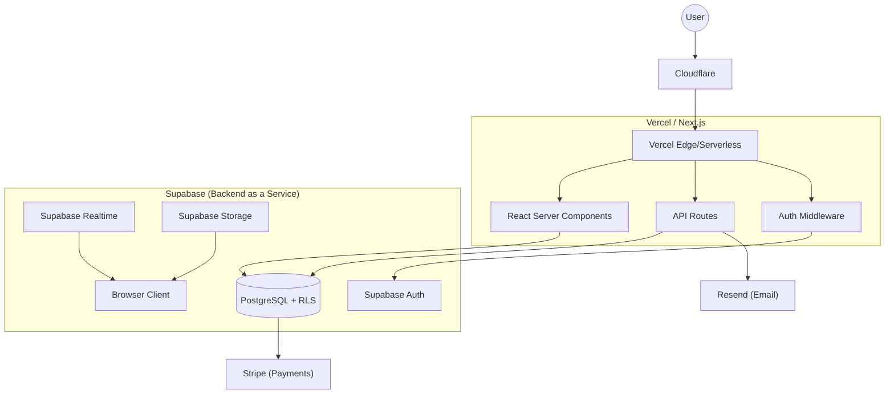

# Kre8ivTech Client Portal
## Technical Specification
**Version:** 2.0  
**Last Updated:** January 20, 2026

---

## Table of Contents

1. [Technology Stack](#1-technology-stack)
2. [Architecture Overview](#2-architecture-overview)
3. [Database Schema](#3-database-schema)
4. [API Specification](#4-api-specification)
5. [Real-Time Infrastructure](#5-real-time-infrastructure)
6. [Storage Architecture](#6-storage-architecture)
7. [Security Implementation](#7-security-implementation)
8. [Infrastructure & DevOps](#8-infrastructure--devops)
9. [Third-Party Integrations](#9-third-party-integrations)
10. [Mobile-First Design](#10-mobile-first-design)

---

## 1. Technology Stack

### 1.1 Core Platform

| Component | Technology | Purpose |
|-----------|------------|---------|
| **Framework** | [Next.js 14+](https://nextjs.org/) | App Router, React Server Components, TypeScript |
| **Hosting** | [Vercel](https://vercel.com/) | Edge Network, Serverless Functions, Cron Jobs |
| **Database** | [Supabase](https://supabase.com/) | PostgreSQL 15+ with Row-Level Security (RLS) |
| **Auth** | [Supabase Auth](https://supabase.com/auth) | Magic links, OAuth, JWT, 2FA |
| **Storage** | [Supabase Storage](https://supabase.com/storage) | File attachments, assets |
| **Real-Time** | [Supabase Realtime](https://supabase.com/realtime) | Postgres Changes, Presence, Broadcast |

### 1.2 Frontend Infrastructure

| Component | Technology | Purpose |
|-----------|------------|---------|
| **Styling** | [Tailwind CSS 3+](https://tailwindcss.com/) | Utility-first CSS |
| **Components** | [Shadcn/ui](https://ui.shadcn.com/) | Radix UI + Tailwind primitive components |
| **Icons** | [Lucide React](https://lucide.dev/) / Font Awesome | Iconography |
| **State** | [TanStack Query](https://tanstack.com/query) + [Zustand](https://zustand-demo.pmnd.rs/) | Server & client state management |
| **Forms** | [React Hook Form](https://react-hook-form.com/) + [Zod](https://zod.dev/) | Type-safe form validation |

### 1.3 External Services

| Component | Technology | Purpose |
|-----------|------------|---------|
| **Payments** | [Stripe](https://stripe.com/) | Subscription management and invoice payments |
| **Email** | [Resend](https://resend.com/) | Transactional email delivery |
| **Analytics** | [Vercel Analytics](https://vercel.com/analytics) | Privacy-friendly usage tracking |

---

## 2. Architecture Overview

### 2.1 High-Level Architecture



### 2.2 Multi-Tenant Architecture

**Tenant Identification:**
1. **Subdomain:** `partner-slug.portal.ktportal.app` (Handled via Vercel middleware)
2. **Custom Domain:** `portal.partnerdomain.com` (Vercel custom domains + Supabase RLS)

**Data Isolation:**
- **Row-Level Security (RLS):** Mandatory on all tables. Queries automatically filtered by `auth.uid()` and organization associations.
- **Tenant Context:** Profiles table links every user to an `organization_id`.

### 2.3 Auth & Data Flow
1. User requests a page.
2. Next.js Middleware checks Supabase session.
3. If valid, Server Component fetches data direct from Supabase via `createServerSupabaseClient`.
4. Supabase applies RLS policies based on the JWT session.
5. Client-side state is synchronized via TanStack Query and Realtime subscriptions.

---

## 3. Database Schema

### 3.1 Core Tables

```sql
-- ============================================
-- ORGANIZATIONS (Tenants)
-- ============================================
CREATE TABLE organizations (
    id UUID PRIMARY KEY DEFAULT gen_random_uuid(),
    name VARCHAR(255) NOT NULL,
    slug VARCHAR(100) UNIQUE NOT NULL,
    type VARCHAR(20) NOT NULL CHECK (type IN ('kre8ivtech', 'partner', 'client')),
    parent_org_id UUID REFERENCES organizations(id),
    
    -- Status
    status VARCHAR(20) DEFAULT 'active' CHECK (status IN ('active', 'inactive', 'suspended')),
    
    -- Branding
    branding_config JSONB DEFAULT '{}',
    -- {
    --   "logo_url": "...",
    --   "favicon_url": "...",
    --   "primary_color": "#3B82F6",
    --   "secondary_color": "#1E40AF",
    --   "font_family": "Inter",
    --   "custom_css": "..."
    -- }
    
    -- Domain
    custom_domain VARCHAR(255),
    custom_domain_verified BOOLEAN DEFAULT FALSE,
    custom_domain_verified_at TIMESTAMP WITH TIME ZONE,
    
    -- Settings
    settings JSONB DEFAULT '{}',
    -- {
    --   "default_payment_terms": "net_30",
    --   "timezone": "America/New_York",
    --   "business_hours": {...}
    -- }
    
    -- Metadata
    created_at TIMESTAMP WITH TIME ZONE DEFAULT NOW(),
    updated_at TIMESTAMP WITH TIME ZONE DEFAULT NOW()
);

CREATE INDEX idx_org_slug ON organizations(slug);
CREATE INDEX idx_org_parent ON organizations(parent_org_id);
CREATE INDEX idx_org_custom_domain ON organizations(custom_domain) WHERE custom_domain IS NOT NULL;

-- ============================================
-- USERS
-- ============================================
CREATE TABLE users (
    id UUID PRIMARY KEY DEFAULT gen_random_uuid(),
    organization_id UUID NOT NULL REFERENCES organizations(id),
    
    -- Identity
    email VARCHAR(255) NOT NULL,
    name VARCHAR(255) NOT NULL,
    avatar_url VARCHAR(500),
    
    -- Auth
    password_hash VARCHAR(255),
    auth_provider VARCHAR(50) DEFAULT 'email',
    mfa_enabled BOOLEAN DEFAULT FALSE,
    mfa_secret VARCHAR(100),
    
    -- Role & Permissions
    role VARCHAR(50) NOT NULL CHECK (role IN ('super_admin', 'staff', 'partner', 'partner_staff', 'client')),
    permissions JSONB DEFAULT '[]',
    
    -- Status
    status VARCHAR(20) DEFAULT 'active' CHECK (status IN ('active', 'inactive', 'invited', 'suspended')),
    email_verified BOOLEAN DEFAULT FALSE,
    email_verified_at TIMESTAMP WITH TIME ZONE,
    
    -- Presence
    presence_status VARCHAR(20) DEFAULT 'offline' CHECK (presence_status IN ('online', 'offline', 'away', 'dnd')),
    last_seen_at TIMESTAMP WITH TIME ZONE,
    
    -- Preferences
    notification_preferences JSONB DEFAULT '{}',
    
    -- Metadata
    invited_by UUID REFERENCES users(id),
    created_at TIMESTAMP WITH TIME ZONE DEFAULT NOW(),
    updated_at TIMESTAMP WITH TIME ZONE DEFAULT NOW(),
    
    UNIQUE(email, organization_id)
);

CREATE INDEX idx_users_org ON users(organization_id);
CREATE INDEX idx_users_email ON users(email);
CREATE INDEX idx_users_role ON users(role);

-- ============================================
-- TICKETS
-- ============================================
CREATE TABLE tickets (
    id UUID PRIMARY KEY DEFAULT gen_random_uuid(),
    organization_id UUID NOT NULL REFERENCES organizations(id),
    
    -- Identifiers
    ticket_number VARCHAR(50) NOT NULL,
    
    -- Content
    subject VARCHAR(500) NOT NULL,
    description TEXT NOT NULL,
    
    -- Classification
    priority VARCHAR(20) NOT NULL DEFAULT 'medium' 
        CHECK (priority IN ('low', 'medium', 'high', 'critical')),
    status VARCHAR(30) NOT NULL DEFAULT 'new'
        CHECK (status IN ('new', 'open', 'in_progress', 'pending_client', 'resolved', 'closed')),
    category VARCHAR(100),
    tags JSONB DEFAULT '[]',
    
    -- Assignment
    created_by UUID NOT NULL REFERENCES users(id),
    assigned_to UUID REFERENCES users(id),
    
    -- Relationships
    parent_ticket_id UUID REFERENCES tickets(id),
    client_org_id UUID REFERENCES organizations(id),
    
    -- SLA
    sla_due_at TIMESTAMP WITH TIME ZONE,
    first_response_at TIMESTAMP WITH TIME ZONE,
    resolved_at TIMESTAMP WITH TIME ZONE,
    
    -- Queue
    queue_position INTEGER,
    queue_calculated_at TIMESTAMP WITH TIME ZONE,
    
    -- Custom fields
    custom_fields JSONB DEFAULT '{}',
    
    -- Metadata
    created_at TIMESTAMP WITH TIME ZONE DEFAULT NOW(),
    updated_at TIMESTAMP WITH TIME ZONE DEFAULT NOW(),
    
    UNIQUE(organization_id, ticket_number)
);

CREATE INDEX idx_tickets_org ON tickets(organization_id);
CREATE INDEX idx_tickets_status ON tickets(status);
CREATE INDEX idx_tickets_priority ON tickets(priority);
CREATE INDEX idx_tickets_assigned ON tickets(assigned_to);
CREATE INDEX idx_tickets_created_by ON tickets(created_by);
CREATE INDEX idx_tickets_client_org ON tickets(client_org_id);

-- ============================================
-- TICKET COMMENTS
-- ============================================
CREATE TABLE ticket_comments (
    id UUID PRIMARY KEY DEFAULT gen_random_uuid(),
    ticket_id UUID NOT NULL REFERENCES tickets(id) ON DELETE CASCADE,
    user_id UUID NOT NULL REFERENCES users(id),
    
    content TEXT NOT NULL,
    is_internal BOOLEAN DEFAULT FALSE,
    
    attachments JSONB DEFAULT '[]',
    -- [{ "id": "...", "filename": "...", "url": "...", "size": 1234 }]
    
    created_at TIMESTAMP WITH TIME ZONE DEFAULT NOW(),
    updated_at TIMESTAMP WITH TIME ZONE DEFAULT NOW()
);

CREATE INDEX idx_comments_ticket ON ticket_comments(ticket_id);

-- ============================================
-- INVOICES
-- ============================================
CREATE TABLE invoices (
    id UUID PRIMARY KEY DEFAULT gen_random_uuid(),
    organization_id UUID NOT NULL REFERENCES organizations(id),
    client_org_id UUID NOT NULL REFERENCES organizations(id),
    
    -- Identifiers
    invoice_number VARCHAR(50) NOT NULL,
    
    -- Line Items
    line_items JSONB NOT NULL DEFAULT '[]',
    -- [{
    --   "description": "Website Development",
    --   "quantity": 1,
    --   "unit_price": 2500.00,
    --   "amount": 2500.00
    -- }]
    
    -- Amounts
    subtotal DECIMAL(12,2) NOT NULL,
    tax_rate DECIMAL(5,4) DEFAULT 0,
    tax_amount DECIMAL(12,2) DEFAULT 0,
    discount_type VARCHAR(20) CHECK (discount_type IN ('percentage', 'fixed')),
    discount_value DECIMAL(12,2) DEFAULT 0,
    discount_amount DECIMAL(12,2) DEFAULT 0,
    total DECIMAL(12,2) NOT NULL,
    amount_paid DECIMAL(12,2) DEFAULT 0,
    amount_due DECIMAL(12,2) GENERATED ALWAYS AS (total - amount_paid) STORED,
    currency VARCHAR(3) DEFAULT 'USD',
    
    -- Status
    status VARCHAR(20) NOT NULL DEFAULT 'draft'
        CHECK (status IN ('draft', 'sent', 'viewed', 'partial', 'paid', 'overdue', 'void')),
    
    -- Dates
    issued_date DATE,
    due_date DATE NOT NULL,
    sent_at TIMESTAMP WITH TIME ZONE,
    viewed_at TIMESTAMP WITH TIME ZONE,
    paid_at TIMESTAMP WITH TIME ZONE,
    
    -- Payment Terms
    payment_terms_id UUID REFERENCES payment_terms(id),
    
    -- Notes
    notes TEXT,
    terms TEXT,
    
    -- Recurring
    recurring_config JSONB,
    -- {
    --   "enabled": true,
    --   "frequency": "monthly",
    --   "next_date": "2026-02-01",
    --   "end_date": null
    -- }
    
    -- Metadata
    created_at TIMESTAMP WITH TIME ZONE DEFAULT NOW(),
    updated_at TIMESTAMP WITH TIME ZONE DEFAULT NOW(),
    
    UNIQUE(organization_id, invoice_number)
);

CREATE INDEX idx_invoices_org ON invoices(organization_id);
CREATE INDEX idx_invoices_client ON invoices(client_org_id);
CREATE INDEX idx_invoices_status ON invoices(status);
CREATE INDEX idx_invoices_due ON invoices(due_date);

-- ============================================
-- PAYMENT TERMS
-- ============================================
CREATE TABLE payment_terms (
    id UUID PRIMARY KEY DEFAULT gen_random_uuid(),
    organization_id UUID REFERENCES organizations(id), -- NULL = system default
    
    name VARCHAR(100) NOT NULL,
    days INTEGER NOT NULL,
    description TEXT,
    
    -- Late fees
    late_fee_type VARCHAR(20) CHECK (late_fee_type IN ('percentage', 'fixed')),
    late_fee_amount DECIMAL(12,2),
    grace_period_days INTEGER DEFAULT 0,
    
    -- Early payment
    early_discount_percent DECIMAL(5,2),
    early_discount_days INTEGER,
    
    is_default BOOLEAN DEFAULT FALSE,
    is_active BOOLEAN DEFAULT TRUE,
    
    created_at TIMESTAMP WITH TIME ZONE DEFAULT NOW()
);

-- ============================================
-- PAYMENTS
-- ============================================
CREATE TABLE payments (
    id UUID PRIMARY KEY DEFAULT gen_random_uuid(),
    invoice_id UUID NOT NULL REFERENCES invoices(id),
    
    amount DECIMAL(12,2) NOT NULL,
    currency VARCHAR(3) DEFAULT 'USD',
    method VARCHAR(50) NOT NULL,
    -- stripe, paypal, bank_transfer, check, cash
    
    -- Provider details
    provider VARCHAR(50),
    transaction_id VARCHAR(255),
    provider_response JSONB,
    
    status VARCHAR(20) NOT NULL DEFAULT 'pending'
        CHECK (status IN ('pending', 'completed', 'failed', 'refunded')),
    
    reference VARCHAR(255),
    notes TEXT,
    
    paid_at TIMESTAMP WITH TIME ZONE,
    created_at TIMESTAMP WITH TIME ZONE DEFAULT NOW()
);

CREATE INDEX idx_payments_invoice ON payments(invoice_id);

-- ============================================
-- CONTRACTS
-- ============================================
CREATE TABLE contracts (
    id UUID PRIMARY KEY DEFAULT gen_random_uuid(),
    organization_id UUID NOT NULL REFERENCES organizations(id),
    client_org_id UUID NOT NULL REFERENCES organizations(id),
    
    -- Template
    template_id UUID REFERENCES contract_templates(id),
    document_type VARCHAR(50) NOT NULL,
    -- proposal, contract, agreement, nda
    
    -- Content
    title VARCHAR(255) NOT NULL,
    content JSONB NOT NULL,
    -- Structured document with sections
    
    -- Variables (filled from template)
    variables JSONB DEFAULT '{}',
    
    -- Status
    status VARCHAR(30) NOT NULL DEFAULT 'draft'
        CHECK (status IN ('draft', 'sent', 'viewed', 'signed', 'countersigned', 'void', 'expired')),
    
    -- Dates
    sent_at TIMESTAMP WITH TIME ZONE,
    viewed_at TIMESTAMP WITH TIME ZONE,
    signed_at TIMESTAMP WITH TIME ZONE,
    countersigned_at TIMESTAMP WITH TIME ZONE,
    expires_at TIMESTAMP WITH TIME ZONE,
    
    -- Signatures
    signature_data JSONB,
    -- {
    --   "client": {
    --     "name": "John Doe",
    --     "signature": "data:image/png;base64,...",
    --     "ip": "192.168.1.1",
    --     "timestamp": "2026-01-20T12:00:00Z"
    --   },
    --   "counter": { ... }
    -- }
    
    -- Generated PDF
    pdf_url VARCHAR(500),
    
    -- Links
    service_request_id UUID,
    project_id UUID,
    
    created_at TIMESTAMP WITH TIME ZONE DEFAULT NOW(),
    updated_at TIMESTAMP WITH TIME ZONE DEFAULT NOW()
);

CREATE INDEX idx_contracts_org ON contracts(organization_id);
CREATE INDEX idx_contracts_client ON contracts(client_org_id);
CREATE INDEX idx_contracts_status ON contracts(status);

-- ============================================
-- CONTRACT TEMPLATES
-- ============================================
CREATE TABLE contract_templates (
    id UUID PRIMARY KEY DEFAULT gen_random_uuid(),
    organization_id UUID REFERENCES organizations(id), -- NULL = system template
    
    name VARCHAR(255) NOT NULL,
    document_type VARCHAR(50) NOT NULL,
    description TEXT,
    
    -- Template content
    content JSONB NOT NULL,
    
    -- Variables schema
    variables_schema JSONB DEFAULT '{}',
    -- Defines required/optional variables
    
    is_active BOOLEAN DEFAULT TRUE,
    
    created_at TIMESTAMP WITH TIME ZONE DEFAULT NOW(),
    updated_at TIMESTAMP WITH TIME ZONE DEFAULT NOW()
);

-- ============================================
-- SERVICE REQUESTS
-- ============================================
CREATE TABLE service_requests (
    id UUID PRIMARY KEY DEFAULT gen_random_uuid(),
    organization_id UUID NOT NULL REFERENCES organizations(id),
    client_org_id UUID REFERENCES organizations(id),
    user_id UUID NOT NULL REFERENCES users(id),
    
    service_type VARCHAR(100) NOT NULL,
    form_id UUID REFERENCES forms(id),
    form_data JSONB NOT NULL DEFAULT '{}',
    
    status VARCHAR(30) NOT NULL DEFAULT 'submitted'
        CHECK (status IN ('submitted', 'reviewing', 'quoted', 'approved', 'rejected', 'converted')),
    
    -- Links
    quote_id UUID,
    contract_id UUID REFERENCES contracts(id),
    project_id UUID,
    
    created_at TIMESTAMP WITH TIME ZONE DEFAULT NOW(),
    updated_at TIMESTAMP WITH TIME ZONE DEFAULT NOW()
);

-- ============================================
-- KNOWLEDGE BASE
-- ============================================
CREATE TABLE kb_categories (
    id UUID PRIMARY KEY DEFAULT gen_random_uuid(),
    organization_id UUID REFERENCES organizations(id), -- NULL = system-wide
    parent_id UUID REFERENCES kb_categories(id),
    
    name VARCHAR(255) NOT NULL,
    slug VARCHAR(255) NOT NULL,
    description TEXT,
    icon VARCHAR(50),
    
    sort_order INTEGER DEFAULT 0,
    is_active BOOLEAN DEFAULT TRUE,
    
    access_level VARCHAR(30) DEFAULT 'public'
        CHECK (access_level IN ('public', 'partner', 'internal', 'client_specific')),
    
    created_at TIMESTAMP WITH TIME ZONE DEFAULT NOW()
);

CREATE TABLE kb_articles (
    id UUID PRIMARY KEY DEFAULT gen_random_uuid(),
    organization_id UUID REFERENCES organizations(id),
    category_id UUID REFERENCES kb_categories(id),
    
    title VARCHAR(500) NOT NULL,
    slug VARCHAR(500) NOT NULL,
    content TEXT NOT NULL,
    excerpt TEXT,
    featured_image VARCHAR(500),
    
    status VARCHAR(20) DEFAULT 'draft'
        CHECK (status IN ('draft', 'published', 'archived')),
    
    access_level VARCHAR(30) DEFAULT 'public'
        CHECK (access_level IN ('public', 'partner', 'internal', 'client_specific')),
    
    tags JSONB DEFAULT '[]',
    
    author_id UUID REFERENCES users(id),
    published_at TIMESTAMP WITH TIME ZONE,
    
    -- Analytics
    view_count INTEGER DEFAULT 0,
    helpful_count INTEGER DEFAULT 0,
    not_helpful_count INTEGER DEFAULT 0,
    
    -- SEO
    meta_title VARCHAR(255),
    meta_description TEXT,
    
    created_at TIMESTAMP WITH TIME ZONE DEFAULT NOW(),
    updated_at TIMESTAMP WITH TIME ZONE DEFAULT NOW()
);

CREATE INDEX idx_kb_articles_category ON kb_articles(category_id);
CREATE INDEX idx_kb_articles_status ON kb_articles(status);
CREATE INDEX idx_kb_articles_org ON kb_articles(organization_id);

-- Full-text search index
CREATE INDEX idx_kb_articles_search ON kb_articles 
    USING gin(to_tsvector('english', title || ' ' || content));

-- ============================================
-- FORMS
-- ============================================
CREATE TABLE forms (
    id UUID PRIMARY KEY DEFAULT gen_random_uuid(),
    organization_id UUID REFERENCES organizations(id), -- NULL = system form
    
    name VARCHAR(255) NOT NULL,
    slug VARCHAR(255) NOT NULL,
    description TEXT,
    
    -- Form definition
    fields JSONB NOT NULL DEFAULT '[]',
    -- [{
    --   "id": "fld_1",
    --   "type": "text",
    --   "label": "Project Name",
    --   "required": true,
    --   "placeholder": "...",
    --   "validation": {...},
    --   "conditions": {...}
    -- }]
    
    settings JSONB DEFAULT '{}',
    -- {
    --   "submit_button_text": "Submit",
    --   "success_message": "Thank you!",
    --   "redirect_url": null,
    --   "notifications": ["email@example.com"],
    --   "submission_limit": null,
    --   "active_from": null,
    --   "active_until": null,
    --   "captcha_enabled": false
    -- }
    
    status VARCHAR(20) DEFAULT 'draft'
        CHECK (status IN ('draft', 'active', 'archived')),
    
    version INTEGER DEFAULT 1,
    
    created_by UUID REFERENCES users(id),
    created_at TIMESTAMP WITH TIME ZONE DEFAULT NOW(),
    updated_at TIMESTAMP WITH TIME ZONE DEFAULT NOW()
);

CREATE TABLE form_submissions (
    id UUID PRIMARY KEY DEFAULT gen_random_uuid(),
    form_id UUID NOT NULL REFERENCES forms(id),
    organization_id UUID REFERENCES organizations(id),
    user_id UUID REFERENCES users(id),
    
    responses JSONB NOT NULL,
    -- { "fld_1": "value", "fld_2": ["option1", "option2"] }
    
    attachments JSONB DEFAULT '[]',
    
    -- Metadata
    ip_address INET,
    user_agent TEXT,
    submitted_at TIMESTAMP WITH TIME ZONE DEFAULT NOW(),
    
    -- Processing
    status VARCHAR(20) DEFAULT 'submitted'
        CHECK (status IN ('submitted', 'processing', 'completed', 'spam')),
    processed_at TIMESTAMP WITH TIME ZONE
);

CREATE INDEX idx_form_submissions_form ON form_submissions(form_id);
CREATE INDEX idx_form_submissions_org ON form_submissions(organization_id);

-- ============================================
-- CONVERSATIONS & MESSAGES
-- ============================================
CREATE TABLE conversations (
    id UUID PRIMARY KEY DEFAULT gen_random_uuid(),
    organization_id UUID REFERENCES organizations(id),
    
    type VARCHAR(30) NOT NULL
        CHECK (type IN ('direct', 'group', 'support', 'project', 'internal')),
    
    title VARCHAR(255),
    
    -- Related entities
    ticket_id UUID REFERENCES tickets(id),
    project_id UUID,
    
    -- Participants
    participant_ids JSONB NOT NULL DEFAULT '[]',
    
    last_message_at TIMESTAMP WITH TIME ZONE,
    
    created_at TIMESTAMP WITH TIME ZONE DEFAULT NOW(),
    updated_at TIMESTAMP WITH TIME ZONE DEFAULT NOW()
);

CREATE TABLE messages (
    id UUID PRIMARY KEY DEFAULT gen_random_uuid(),
    conversation_id UUID NOT NULL REFERENCES conversations(id) ON DELETE CASCADE,
    sender_id UUID NOT NULL REFERENCES users(id),
    
    content TEXT NOT NULL,
    message_type VARCHAR(20) DEFAULT 'text'
        CHECK (message_type IN ('text', 'file', 'system', 'action')),
    
    attachments JSONB DEFAULT '[]',
    
    -- Read tracking
    read_by JSONB DEFAULT '[]',
    -- [{ "user_id": "...", "read_at": "..." }]
    
    edited_at TIMESTAMP WITH TIME ZONE,
    deleted_at TIMESTAMP WITH TIME ZONE,
    
    created_at TIMESTAMP WITH TIME ZONE DEFAULT NOW()
);

CREATE INDEX idx_messages_conversation ON messages(conversation_id);
CREATE INDEX idx_messages_sender ON messages(sender_id);
CREATE INDEX idx_messages_created ON messages(created_at);

-- ============================================
-- LIVE CHAT
-- ============================================
CREATE TABLE chat_sessions (
    id UUID PRIMARY KEY DEFAULT gen_random_uuid(),
    organization_id UUID NOT NULL REFERENCES organizations(id),
    
    -- Visitor (can be anonymous or user)
    visitor_id UUID REFERENCES users(id),
    visitor_name VARCHAR(255),
    visitor_email VARCHAR(255),
    
    -- Agent
    agent_id UUID REFERENCES users(id),
    
    -- Pre-chat data
    pre_chat_data JSONB DEFAULT '{}',
    
    -- Status
    status VARCHAR(20) NOT NULL DEFAULT 'waiting'
        CHECK (status IN ('waiting', 'active', 'ended', 'missed')),
    
    -- Queue
    queue_position INTEGER,
    
    -- Timing
    started_at TIMESTAMP WITH TIME ZONE DEFAULT NOW(),
    accepted_at TIMESTAMP WITH TIME ZONE,
    ended_at TIMESTAMP WITH TIME ZONE,
    
    -- Satisfaction
    satisfaction_rating INTEGER CHECK (satisfaction_rating BETWEEN 1 AND 5),
    satisfaction_comment TEXT,
    
    -- Conversion
    converted_ticket_id UUID REFERENCES tickets(id),
    
    created_at TIMESTAMP WITH TIME ZONE DEFAULT NOW()
);

CREATE TABLE chat_messages (
    id UUID PRIMARY KEY DEFAULT gen_random_uuid(),
    session_id UUID NOT NULL REFERENCES chat_sessions(id) ON DELETE CASCADE,
    
    sender_type VARCHAR(20) NOT NULL
        CHECK (sender_type IN ('visitor', 'agent', 'system', 'bot')),
    sender_id UUID,
    
    content TEXT NOT NULL,
    
    -- Internal notes (whisper)
    is_internal BOOLEAN DEFAULT FALSE,
    
    attachments JSONB DEFAULT '[]',
    
    created_at TIMESTAMP WITH TIME ZONE DEFAULT NOW()
);

CREATE INDEX idx_chat_messages_session ON chat_messages(session_id);

-- ============================================
-- FILES
-- ============================================
CREATE TABLE files (
    id UUID PRIMARY KEY DEFAULT gen_random_uuid(),
    organization_id UUID NOT NULL REFERENCES organizations(id),
    uploaded_by UUID REFERENCES users(id),
    
    -- File info
    filename VARCHAR(255) NOT NULL,
    original_filename VARCHAR(255) NOT NULL,
    content_type VARCHAR(100) NOT NULL,
    size_bytes BIGINT NOT NULL,
    
    -- Storage
    s3_bucket VARCHAR(100) NOT NULL,
    s3_key VARCHAR(500) NOT NULL,
    
    -- Linked entity
    entity_type VARCHAR(50),
    entity_id UUID,
    
    -- Access
    is_public BOOLEAN DEFAULT FALSE,
    
    -- Soft delete
    deleted_at TIMESTAMP WITH TIME ZONE,
    
    created_at TIMESTAMP WITH TIME ZONE DEFAULT NOW()
);

CREATE INDEX idx_files_org ON files(organization_id);
CREATE INDEX idx_files_entity ON files(entity_type, entity_id);

-- ============================================
-- STORAGE USAGE
-- ============================================
CREATE TABLE storage_usage (
    id UUID PRIMARY KEY DEFAULT gen_random_uuid(),
    organization_id UUID NOT NULL REFERENCES organizations(id) UNIQUE,
    
    storage_limit_bytes BIGINT NOT NULL DEFAULT 5368709120, -- 5 GB
    storage_used_bytes BIGINT NOT NULL DEFAULT 0,
    file_count INTEGER NOT NULL DEFAULT 0,
    
    last_calculated_at TIMESTAMP WITH TIME ZONE,
    
    created_at TIMESTAMP WITH TIME ZONE DEFAULT NOW(),
    updated_at TIMESTAMP WITH TIME ZONE DEFAULT NOW()
);

-- ============================================
-- AUDIT LOG
-- ============================================
CREATE TABLE audit_logs (
    id UUID PRIMARY KEY DEFAULT gen_random_uuid(),
    organization_id UUID REFERENCES organizations(id),
    user_id UUID REFERENCES users(id),
    
    action VARCHAR(100) NOT NULL,
    entity_type VARCHAR(50),
    entity_id UUID,
    
    -- Changes
    old_values JSONB,
    new_values JSONB,
    
    -- Request context
    ip_address INET,
    user_agent TEXT,
    
    created_at TIMESTAMP WITH TIME ZONE DEFAULT NOW()
);

CREATE INDEX idx_audit_org ON audit_logs(organization_id);
CREATE INDEX idx_audit_user ON audit_logs(user_id);
CREATE INDEX idx_audit_action ON audit_logs(action);
CREATE INDEX idx_audit_created ON audit_logs(created_at);

-- Partition by month for retention (30 days)
-- Implementation depends on PostgreSQL version

-- ============================================
-- TASKS (Internal)
-- ============================================
CREATE TABLE tasks (
    id UUID PRIMARY KEY DEFAULT gen_random_uuid(),
    organization_id UUID NOT NULL REFERENCES organizations(id),
    
    title VARCHAR(500) NOT NULL,
    description TEXT,
    
    status VARCHAR(20) NOT NULL DEFAULT 'todo'
        CHECK (status IN ('todo', 'in_progress', 'done', 'cancelled')),
    priority VARCHAR(20) DEFAULT 'medium'
        CHECK (priority IN ('low', 'medium', 'high')),
    
    -- Assignment
    assigned_to UUID REFERENCES users(id),
    created_by UUID REFERENCES users(id),
    
    -- Dates
    due_date DATE,
    completed_at TIMESTAMP WITH TIME ZONE,
    
    -- Time
    estimated_hours DECIMAL(6,2),
    logged_hours DECIMAL(6,2) DEFAULT 0,
    
    -- Links
    ticket_id UUID REFERENCES tickets(id),
    project_id UUID,
    
    -- Subtasks
    subtasks JSONB DEFAULT '[]',
    -- [{ "id": "...", "title": "...", "done": false }]
    
    created_at TIMESTAMP WITH TIME ZONE DEFAULT NOW(),
    updated_at TIMESTAMP WITH TIME ZONE DEFAULT NOW()
);

CREATE INDEX idx_tasks_org ON tasks(organization_id);
CREATE INDEX idx_tasks_assigned ON tasks(assigned_to);
CREATE INDEX idx_tasks_status ON tasks(status);

-- ============================================
-- TIME ENTRIES (Internal)
-- ============================================
CREATE TABLE time_entries (
    id UUID PRIMARY KEY DEFAULT gen_random_uuid(),
    organization_id UUID NOT NULL REFERENCES organizations(id),
    user_id UUID NOT NULL REFERENCES users(id),
    
    -- Duration
    duration_minutes INTEGER NOT NULL,
    started_at TIMESTAMP WITH TIME ZONE,
    ended_at TIMESTAMP WITH TIME ZONE,
    
    -- Description
    description TEXT,
    
    -- Billable
    is_billable BOOLEAN DEFAULT TRUE,
    hourly_rate DECIMAL(10,2),
    
    -- Links
    ticket_id UUID REFERENCES tickets(id),
    task_id UUID REFERENCES tasks(id),
    project_id UUID,
    
    created_at TIMESTAMP WITH TIME ZONE DEFAULT NOW()
);

CREATE INDEX idx_time_entries_org ON time_entries(organization_id);
CREATE INDEX idx_time_entries_user ON time_entries(user_id);

-- ============================================
-- PARTNER WORK VOLUME (Aggregates)
-- ============================================
CREATE TABLE partner_work_volume (
    id UUID PRIMARY KEY DEFAULT gen_random_uuid(),
    partner_org_id UUID NOT NULL REFERENCES organizations(id),
    
    -- Period
    period_year INTEGER NOT NULL,
    period_month INTEGER NOT NULL,
    
    -- Metrics
    tickets_submitted INTEGER DEFAULT 0,
    tickets_resolved INTEGER DEFAULT 0,
    service_requests INTEGER DEFAULT 0,
    projects_started INTEGER DEFAULT 0,
    projects_completed INTEGER DEFAULT 0,
    hours_logged DECIMAL(10,2) DEFAULT 0,
    revenue_generated DECIMAL(12,2) DEFAULT 0,
    
    calculated_at TIMESTAMP WITH TIME ZONE DEFAULT NOW(),
    
    UNIQUE(partner_org_id, period_year, period_month)
);

-- ============================================
-- NOTIFICATIONS
-- ============================================
CREATE TABLE notifications (
    id UUID PRIMARY KEY DEFAULT gen_random_uuid(),
    user_id UUID NOT NULL REFERENCES users(id),
    
    type VARCHAR(100) NOT NULL,
    title VARCHAR(255) NOT NULL,
    body TEXT,
    
    -- Link
    action_url VARCHAR(500),
    entity_type VARCHAR(50),
    entity_id UUID,
    
    -- Status
    read_at TIMESTAMP WITH TIME ZONE,
    
    -- Channels sent
    sent_email BOOLEAN DEFAULT FALSE,
    sent_push BOOLEAN DEFAULT FALSE,
    sent_sms BOOLEAN DEFAULT FALSE,
    
    created_at TIMESTAMP WITH TIME ZONE DEFAULT NOW()
);

CREATE INDEX idx_notifications_user ON notifications(user_id);
CREATE INDEX idx_notifications_unread ON notifications(user_id) WHERE read_at IS NULL;

-- ============================================
-- WEBHOOKS
-- ============================================
CREATE TABLE webhooks (
    id UUID PRIMARY KEY DEFAULT gen_random_uuid(),
    organization_id UUID NOT NULL REFERENCES organizations(id),
    
    url VARCHAR(500) NOT NULL,
    events JSONB NOT NULL DEFAULT '[]',
    -- ["ticket.created", "invoice.paid", ...]
    
    secret VARCHAR(255) NOT NULL,
    
    is_active BOOLEAN DEFAULT TRUE,
    
    -- Stats
    last_triggered_at TIMESTAMP WITH TIME ZONE,
    failure_count INTEGER DEFAULT 0,
    
    created_at TIMESTAMP WITH TIME ZONE DEFAULT NOW()
);

CREATE TABLE webhook_logs (
    id UUID PRIMARY KEY DEFAULT gen_random_uuid(),
    webhook_id UUID NOT NULL REFERENCES webhooks(id) ON DELETE CASCADE,
    
    event_type VARCHAR(100) NOT NULL,
    payload JSONB NOT NULL,
    
    -- Response
    response_status INTEGER,
    response_body TEXT,
    response_time_ms INTEGER,
    
    success BOOLEAN NOT NULL,
    error_message TEXT,
    
    created_at TIMESTAMP WITH TIME ZONE DEFAULT NOW()
);

-- ============================================
-- API KEYS
-- ============================================
CREATE TABLE api_keys (
    id UUID PRIMARY KEY DEFAULT gen_random_uuid(),
    organization_id UUID NOT NULL REFERENCES organizations(id),
    user_id UUID REFERENCES users(id),
    
    name VARCHAR(255) NOT NULL,
    key_hash VARCHAR(255) NOT NULL,
    key_prefix VARCHAR(20) NOT NULL, -- kt_live_, kt_test_, kt_readonly_
    
    scopes JSONB DEFAULT '[]',
    
    -- Limits
    rate_limit_per_minute INTEGER DEFAULT 60,
    
    -- Status
    is_active BOOLEAN DEFAULT TRUE,
    expires_at TIMESTAMP WITH TIME ZONE,
    last_used_at TIMESTAMP WITH TIME ZONE,
    
    created_at TIMESTAMP WITH TIME ZONE DEFAULT NOW()
);

CREATE INDEX idx_api_keys_prefix ON api_keys(key_prefix);

-- ============================================
-- ROW LEVEL SECURITY
-- ============================================

-- Enable RLS on all tenant tables
ALTER TABLE organizations ENABLE ROW LEVEL SECURITY;
ALTER TABLE users ENABLE ROW LEVEL SECURITY;
ALTER TABLE tickets ENABLE ROW LEVEL SECURITY;
ALTER TABLE invoices ENABLE ROW LEVEL SECURITY;
-- ... etc for all tables

-- Example policy for tickets
CREATE POLICY tenant_isolation_tickets ON tickets
    USING (
        organization_id = current_setting('app.current_org_id')::uuid
        OR EXISTS (
            SELECT 1 FROM organizations 
            WHERE id = tickets.client_org_id 
            AND parent_org_id = current_setting('app.current_org_id')::uuid
        )
    );
```

### 3.2 Entity Relationship Summary

```
organizations (tenants)
├── users
├── tickets
│   └── ticket_comments
├── invoices
│   └── payments
├── contracts
├── service_requests
├── kb_categories
│   └── kb_articles
├── forms
│   └── form_submissions
├── conversations
│   └── messages
├── chat_sessions
│   └── chat_messages
├── files
├── storage_usage
├── tasks
├── time_entries
├── notifications
├── webhooks
│   └── webhook_logs
└── api_keys
```

---

## 4. API Specification

### 4.1 Base Configuration

```yaml
openapi: 3.0.3
info:
  title: KT-Portal API
  version: 1.0.0
  
servers:
  - url: https://api.portal.kre8ivtech.com/v1
    description: Production
  - url: https://api.sandbox.portal.kre8ivtech.com/v1
    description: Sandbox
```

### 4.2 Authentication

```http
# API Key (Header)
Authorization: Bearer kt_live_abc123...

# API Key (Query - not recommended)
GET /tickets?api_key=kt_live_abc123...
```

### 4.3 Rate Limits

| Tier | Requests/Min | Daily Limit |
|------|--------------|-------------|
| Standard | 60 | 10,000 |
| Professional | 120 | 50,000 |
| Enterprise | 300 | Unlimited |

### 4.4 Core Endpoints

See [API Endpoint Reference](#api-endpoint-reference) in appendix.

**Summary:**

| Resource | Endpoints |
|----------|-----------|
| `/tickets` | CRUD, comments, close |
| `/organizations` | CRUD, storage |
| `/users` | CRUD, invite |
| `/invoices` | CRUD, send, payments |
| `/contracts` | CRUD, send, sign |
| `/service-requests` | CRUD |
| `/knowledge-base` | Categories, articles |
| `/forms` | CRUD, submissions |
| `/conversations` | CRUD, messages |
| `/webhooks` | CRUD, logs |
| `/uploads` | Presign, confirm |

---

## 5. Real-Time Infrastructure

### 5.1 WebSocket Architecture

```python
# FastAPI WebSocket endpoint
@app.websocket("/ws")
async def websocket_endpoint(websocket: WebSocket):
    await websocket.accept()
    
    # Authenticate
    token = websocket.query_params.get("token")
    user = await authenticate_ws(token)
    
    # Subscribe to channels
    await channel_manager.subscribe(user.id, websocket)
    await channel_manager.subscribe(f"org:{user.organization_id}", websocket)
    
    try:
        while True:
            data = await websocket.receive_json()
            await handle_ws_message(user, data)
    except WebSocketDisconnect:
        await channel_manager.unsubscribe(user.id)
```

### 5.2 Event Types

```typescript
// Client subscribes to channels
{
  "type": "subscribe",
  "channels": ["tickets", "notifications", "chat"]
}

// Server pushes events
{
  "type": "ticket.updated",
  "data": {
    "ticket_id": "tkt_abc123",
    "status": "in_progress",
    "queue_position": 2
  }
}

{
  "type": "notification",
  "data": {
    "id": "notif_xyz",
    "title": "New message",
    "body": "Sarah replied to your ticket"
  }
}

{
  "type": "chat.message",
  "data": {
    "session_id": "chat_123",
    "content": "Hello!",
    "sender": "agent"
  }
}
```

### 5.3 Redis Pub/Sub

```python
# Publishing events
async def publish_event(channel: str, event: dict):
    await redis.publish(channel, json.dumps(event))

# Subscribing (in WebSocket handler)
async def subscribe_to_redis():
    pubsub = redis.pubsub()
    await pubsub.subscribe(f"org:{org_id}")
    
    async for message in pubsub.listen():
        if message["type"] == "message":
            await broadcast_to_org(org_id, message["data"])
```

---

## 6. Storage Architecture

### 6.1 AWS S3 Configuration

```python
STORAGE_CONFIG = {
    "bucket": "kt-portal-files",
    "region": "us-east-1",
    
    "default_limit_bytes": 5 * 1024**3,  # 5 GB
    "max_file_size_bytes": 50 * 1024**2,  # 50 MB
    
    "allowed_types": {
        "documents": [".pdf", ".doc", ".docx", ".xls", ".xlsx"],
        "images": [".jpg", ".jpeg", ".png", ".gif", ".webp"],
        "archives": [".zip", ".rar"],
    },
    
    "presigned_url_expiry": 3600,  # 1 hour
}
```

### 6.2 Bucket Structure

```
kt-portal-files/
├── organizations/{org_id}/
│   ├── attachments/
│   │   ├── tickets/
│   │   ├── messages/
│   │   └── forms/
│   ├── documents/
│   │   ├── contracts/
│   │   ├── invoices/
│   │   └── proposals/
│   ├── branding/
│   └── knowledge-base/
├── temp/
└── system/
```

### 6.3 Pre-signed Upload Flow

```python
@router.post("/uploads/presign")
async def create_presigned_upload(
    filename: str,
    content_type: str,
    size_bytes: int,
    current_user: User = Depends(get_current_user)
):
    # Check storage limit
    usage = await get_storage_usage(current_user.organization_id)
    if usage.storage_used_bytes + size_bytes > usage.storage_limit_bytes:
        raise HTTPException(413, "Storage limit exceeded")
    
    # Generate presigned URL
    upload_id = str(uuid4())
    s3_key = f"temp/{upload_id}/{filename}"
    
    presigned = s3_client.generate_presigned_url(
        "put_object",
        Params={
            "Bucket": BUCKET,
            "Key": s3_key,
            "ContentType": content_type,
        },
        ExpiresIn=3600
    )
    
    return {
        "upload_id": upload_id,
        "upload_url": presigned,
        "expires_at": datetime.utcnow() + timedelta(hours=1)
    }
```

---

## 7. Security Implementation

### 7.1 Authentication Flow

```python
# JWT configuration
JWT_SECRET = os.environ["JWT_SECRET"]
JWT_ALGORITHM = "HS256"
JWT_EXPIRE_MINUTES = 30
REFRESH_TOKEN_EXPIRE_DAYS = 7

# Token generation
def create_access_token(user_id: str, org_id: str) -> str:
    payload = {
        "sub": user_id,
        "org": org_id,
        "exp": datetime.utcnow() + timedelta(minutes=JWT_EXPIRE_MINUTES),
        "type": "access"
    }
    return jwt.encode(payload, JWT_SECRET, algorithm=JWT_ALGORITHM)
```

### 7.2 Row-Level Security

```sql
-- Set tenant context on each request
SET app.current_org_id = 'org_uuid_here';

-- Policies automatically filter data
SELECT * FROM tickets;  -- Only returns tickets for current org
```

### 7.3 API Key Hashing

```python
import hashlib
import secrets

def generate_api_key(prefix: str = "kt_live_") -> tuple[str, str]:
    """Returns (full_key, hash_for_storage)"""
    random_part = secrets.token_urlsafe(32)
    full_key = f"{prefix}{random_part}"
    key_hash = hashlib.sha256(full_key.encode()).hexdigest()
    return full_key, key_hash
```

---

## 8. Infrastructure & DevOps

### 8.1 Docker Configuration

```yaml
# docker-compose.yml
version: '3.8'

services:
  api:
    build: ./backend
    environment:
      - DATABASE_URL=postgresql://...
      - REDIS_URL=redis://redis:6379
    depends_on:
      - db
      - redis

  frontend:
    build: ./frontend
    ports:
      - "3000:3000"

  db:
    image: postgres:15
    volumes:
      - postgres_data:/var/lib/postgresql/data
    environment:
      - POSTGRES_DB=ktportal

  redis:
    image: redis:7-alpine

  celery:
    build: ./backend
    command: celery -A app.celery worker -l info

  nginx:
    image: nginx:alpine
    ports:
      - "80:80"
      - "443:443"
    volumes:
      - ./nginx.conf:/etc/nginx/nginx.conf
```

### 8.2 Environment Variables

```bash
# .env.example
DATABASE_URL=postgresql://user:pass@<db-host>:5432/ktportal
REDIS_URL=redis://<redis-host>:6379

JWT_SECRET=your-secret-key
JWT_ALGORITHM=HS256

AWS_ACCESS_KEY_ID=xxx
AWS_SECRET_ACCESS_KEY=xxx
AWS_S3_BUCKET=kt-portal-files
AWS_REGION=us-east-1

STRIPE_SECRET_KEY=sk_live_xxx
STRIPE_WEBHOOK_SECRET=whsec_xxx

SENDGRID_API_KEY=SG.xxx
EMAIL_FROM=noreply@kre8ivtech.com

SENTRY_DSN=https://xxx@sentry.io/xxx
```

### 8.3 CI/CD Pipeline

```yaml
# .github/workflows/deploy.yml
name: Deploy

on:
  push:
    branches: [main]

jobs:
  test:
    runs-on: ubuntu-latest
    steps:
      - uses: actions/checkout@v3
      - name: Run tests
        run: |
          pip install -r requirements.txt
          pytest

  deploy:
    needs: test
    runs-on: ubuntu-latest
    steps:
      - name: Deploy to production
        run: |
          # Deploy commands
```

---

## 9. Third-Party Integrations

### 9.1 Integration Priority

**Phase 1 (Required):**
- Stripe — Payments
- SendGrid/Postmark — Email
- AWS S3 — File storage
- Cloudflare — DNS, CDN

**Phase 2:**
- Twilio — SMS, 2FA
- Firebase/OneSignal — Push notifications

**Phase 3:**
- DocuSign/HelloSign — E-signatures
- QuickBooks/Xero — Accounting
- Slack — Notifications
- Calendly — Scheduling

### 9.2 Stripe Integration

```python
import stripe

stripe.api_key = os.environ["STRIPE_SECRET_KEY"]

async def create_payment_intent(invoice_id: str, amount: int):
    invoice = await get_invoice(invoice_id)
    
    intent = stripe.PaymentIntent.create(
        amount=amount,  # in cents
        currency="usd",
        metadata={
            "invoice_id": invoice_id,
            "organization_id": str(invoice.organization_id)
        }
    )
    
    return intent.client_secret
```

---

## 10. Mobile-First Design

### 10.1 Responsive Breakpoints

```css
/* Tailwind defaults */
sm: 640px   /* Small devices */
md: 768px   /* Tablets */
lg: 1024px  /* Laptops */
xl: 1280px  /* Desktops */
2xl: 1536px /* Large screens */
```

### 10.2 Mobile Patterns

- Bottom navigation (thumb-friendly)
- Swipe gestures for actions
- Pull-to-refresh
- Sheet modals (slide up)
- Floating action buttons
- Touch-optimized inputs (min 44px)

### 10.3 PWA Configuration

```json
// manifest.json
{
  "name": "KT Portal",
  "short_name": "KT Portal",
  "start_url": "/",
  "display": "standalone",
  "background_color": "#ffffff",
  "theme_color": "#3B82F6",
  "icons": [
    {
      "src": "/icons/icon-192.png",
      "sizes": "192x192",
      "type": "image/png"
    },
    {
      "src": "/icons/icon-512.png",
      "sizes": "512x512",
      "type": "image/png"
    }
  ]
}
```

### 10.4 Performance Targets

| Metric | Target |
|--------|--------|
| First Contentful Paint | < 1.5s |
| Time to Interactive | < 3s |
| Largest Contentful Paint | < 2.5s |
| Cumulative Layout Shift | < 0.1 |
| Lighthouse Score (Mobile) | > 90 |

---

## Appendix: API Endpoint Reference

### Tickets

| Method | Endpoint | Description |
|--------|----------|-------------|
| GET | `/tickets` | List tickets |
| POST | `/tickets` | Create ticket |
| GET | `/tickets/{id}` | Get ticket |
| PATCH | `/tickets/{id}` | Update ticket |
| DELETE | `/tickets/{id}` | Delete ticket |
| POST | `/tickets/{id}/comments` | Add comment |
| POST | `/tickets/{id}/close` | Close ticket |

### Organizations

| Method | Endpoint | Description |
|--------|----------|-------------|
| GET | `/organizations` | List organizations |
| POST | `/organizations` | Create organization |
| GET | `/organizations/{id}` | Get organization |
| PATCH | `/organizations/{id}` | Update organization |
| GET | `/organizations/{id}/storage` | Get storage usage |
| PATCH | `/organizations/{id}/storage` | Update storage limit |

### Invoices

| Method | Endpoint | Description |
|--------|----------|-------------|
| GET | `/invoices` | List invoices |
| POST | `/invoices` | Create invoice |
| GET | `/invoices/{id}` | Get invoice |
| PATCH | `/invoices/{id}` | Update invoice |
| POST | `/invoices/{id}/send` | Send invoice |
| POST | `/invoices/{id}/payments` | Record payment |

### Webhooks

| Method | Endpoint | Description |
|--------|----------|-------------|
| GET | `/webhooks` | List webhooks |
| POST | `/webhooks` | Create webhook |
| GET | `/webhooks/{id}` | Get webhook |
| PATCH | `/webhooks/{id}` | Update webhook |
| DELETE | `/webhooks/{id}` | Delete webhook |
| GET | `/webhooks/{id}/logs` | Get delivery logs |

---

*Technical Specification for KT-Portal*  
*Version 2.0 — January 20, 2026*
